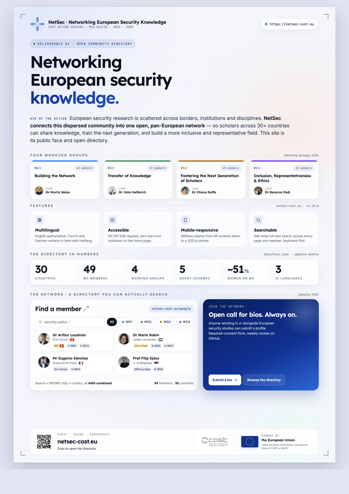

# NetSec — COST Action CA24154 website

<p align="center">
  <a href="https://netsec-cost.eu/press-kit.html">
    
  </a>
</p>

> Official website and open community directory of **COST Action
> CA24154 — Networking European Security Knowledge (NetSec)**.

🌐 **Live site:** <https://netsec-cost.eu>
🏛️ **COST page:** <https://www.cost.eu/actions/CA24154/>
🗓️ **Action running:** 10 Oct 2025 – 09 Oct 2029
📜 **Code licence:** [MIT](LICENSE) · **Content licence:** [CC BY 4.0](LICENSE-CONTENT)

This site doubles as the Action's **Deliverable D1** (open community
directory) and is maintained by [Dr Arthur Laudrain](https://netsec-cost.eu/people.html#arthur-laudrain)
(MC member, CH).

---

## Contents

- [Overview](#overview)
- [Repository layout](#repository-layout)
- [Local development](#local-development)
- [Automated pipelines](#automated-pipelines)
- [Editing content](#editing-content)
- [Contributing](#contributing)
- [Security](#security)
- [Privacy & GDPR](#privacy--gdpr)
- [Licensing](#licensing)
- [Brand and press kit](#brand-and-press-kit)
- [Acknowledgements](#acknowledgements)

> 📚 **For maintainers**: see [`docs/`](./docs/) for deep
> documentation — site architecture and data-flow diagrams, the
> design system, the admin guide (accounts, logins, common tasks),
> and the Google Form set-up walkthrough.

---

## Overview

The site is a small, dependency-light **static** GitHub Pages
deployment. The build step is a single GitHub Actions job that
generates the Pagefind search index and uploads the working tree
to Pages; every page is hand-authored HTML that loads a shared CSS
stylesheet, a shared JS file, and reads JSON data files at runtime
for the directory, the calendar, and the live ESSC programme.

Design principles:

- **Apple-style glassmorphism** with a manual light/dark theme toggle
  (default follows `prefers-color-scheme`, override stored in
  `localStorage`).
- **Authoritative British English** with **manually-translated French
  and German variants** at `*.fr.html` and `*.de.html`. No machine
  translation; FR/DE pages carry a beta ribbon stating the English
  version is canonical. Drift between EN and the translations is
  enforced by `scripts/check-i18n-drift.py` in CI on every PR
  touching HTML.
- **Accessible by default**: skip links, ARIA landmarks, no
  content hidden behind hover, all interactive controls keyboard
  reachable. See [accessibility.html](https://netsec-cost.eu/accessibility.html).
- **Authoritative sources upstream**: `data/bios.json` (the directory),
  `data/indico.json` (the live ESSC programme), and the per-bio
  `wgs` field are all reconciled against upstream services on a
  weekly cadence. Three scheduled GitHub Actions keep them in step
  with cost.eu, the Indico instance hosting the ESSC programme,
  and a public Google Form for new bio submissions.

## Repository layout

Sixteen public pages, each with an authoritative EN version and
manually-translated FR + DE siblings (e.g. `about.html` /
`about.fr.html` / `about.de.html`). The listing below shows only
the EN page; the FR/DE variants sit alongside.

```
.
├── index.html              # Home (news, working groups, MC, events, contact)
├── about.html              # Action narrative, audiences, deliverables
├── people.html             # The Network — open directory, runtime-rendered from data/bios.json
├── essc-2026.html          # Live ESSC programme (rebuilt daily from indico.eiss-europa.com)
├── summer-school.html      # NetSec Summer School (ECS³) — faculty roster, EISS partner block, application contact
├── grants.html             # Grants & Calls — five NetSec grant schemes + e-COST workflow
├── news.html               # News archive (curated entries from data/news.json)
├── outputs.html            # Publications listing (placeholder until D6 lands)
├── roadmap.html            # Public visual roadmap — what's shipped, what's coming, when
├── press-kit.html          # Press kit (poster, boilerplate, brand assets, attribution)
├── faq.html                # FAQ (canonical version; Wiki has stubs pointing here)
├── glossary.html           # COST + NetSec acronyms and term-of-art definitions
├── accessibility.html      # WCAG 2.1 conformance statement
├── privacy.html            # GDPR-compliant privacy notice
├── licensing.html          # Dual MIT + CC BY 4.0 licence summary
├── sitemap.html            # User-friendly site map (linked from every footer)
├── sitemap.xml             # Machine-readable sitemap (hand-maintained lastmod stamps)
├── manifest.webmanifest    # PWA manifest (theme colour, icons, brand metadata)
├── calendar.ics            # Webcal feed (regenerated from data/events.json by sync-indico)
├── assets/
│   ├── css/site.css        # Shared stylesheet (theme tokens, glass, components, responsive)
│   ├── js/site.js          # Shared scripts (nav, theme toggle, reveal-on-scroll, MC accordion)
│   ├── fonts/              # Self-hosted Inter + Lexend WOFF2 with critical-subset preloads
│   ├── images/brand/       # NetSec logo family (lockup + dark variant + mark, favicon set)
│   └── images/people/      # Member headshots downloaded + downscaled by sync-bios.py
├── data/
│   ├── bios.json           # The directory (members, roles, WGs, keywords, contacts, photos)
│   ├── mc-members.json     # MC roster per country — used to auto-tag "MC member · <Country>"
│   ├── events.json         # Calendar source (regenerated into calendar.ics; banners read it)
│   ├── indico.json         # Live ESSC programme (refreshed daily from indico.eiss-europa.com)
│   ├── news.json           # Curated news entries shown on home and /news.html
│   ├── keyword-aliases.json # Curated alias map + acronym preservation for directory keywords
│   ├── i18n-state.json     # SHA-1 hashes for the EN-to-FR/DE drift checker
│   └── indico-fix-plans/   # YAML fix-plan inputs, applied via `indico netsec apply-fixplan` (plugin CLI)
├── scripts/
│   ├── sync-cost.py        # Weekly: WG_MAP + per-bio wgs + leadership roles from cost.eu
│   ├── sync-bios.py        # Daily:  Google Form submissions → data/bios.json + headshots
│   ├── sync-indico.py      # Daily:  indico.eiss-europa.com → data/indico.json + calendar.ics
│   ├── sync-roadmap.py     # On CHANGELOG.md push: refresh autostamp in docs/roadmap-2026.md
│   ├── promote-roadmap.py  # Called by release.sh: flip planned roadmap card to shipped (EN/FR/DE)
│   ├── indico_clean_duplicate.py # Manual: ESSC-N to ESSC-N+1 rollover after Indico duplicate
│   ├── release.sh          # Promote CHANGELOG [Unreleased] to dated section; tag; publish
│   ├── inject-seo.py       # Idempotent SEO + JSON-LD block regeneration across all pages
│   ├── build-search.sh     # Build Pagefind index + bio search stubs (called by Pages deploy)
│   ├── build-brand-assets.py     # Crop + rasterise designer PNGs into deployment set
│   ├── update-brand-html.py      # Replace placeholder brand markup across all HTML
│   ├── check-i18n-drift.py       # EN-to-FR/DE drift check (CI on every HTML PR)
│   ├── check-css-class-collisions.py # CSS class shadowing lint (CI on every site.css PR)
│   ├── check-external-link-arrows.py # External-link arrow-glyph lint
│   ├── test-sync-*.py / test-promote-roadmap.py  # Smoke-test suites (standalone runnable)
│   └── requirements.txt    # Python deps (requests, beautifulsoup4, Pillow)
├── .github/
│   ├── ISSUE_TEMPLATE/     # YAML issue forms (bug, enhancement, documentation) + config.yml
│   └── workflows/          # Twelve workflows, see "Automated pipelines" table below
├── docs/
│   ├── README.md           # Index of internal documentation
│   ├── architecture.md     # Purpose, structure, features, data-flow diagrams
│   ├── design-system.md    # Colour tokens, typography, components, accessibility
│   ├── admin-guide.md      # Accounts, logins, routine tasks, handover checklist
│   ├── bios-setup.md       # Google Form set-up + per-field merge semantics + cost.eu sync rule
│   ├── i18n.md             # FR/DE workflow + drift-checker contract
│   ├── seo.md              # OG / JSON-LD / canonical / hreflang / sitemap conventions
│   ├── security.md         # Threat model + disclosure timeline (companion to SECURITY.md)
│   ├── indico-sync.md      # Read-side: nightly Indico → indico.json + calendar.ics
│   ├── indico-patch.md     # Write-side: retirement notice (superseded by the plugin CLI, #824)
│   ├── brand-deployment.md # Designer-hand-off workflow for the NetSec logo refresh
│   ├── launch-qa-2026.md   # Pre-launch QA checklist + journey-test record
│   ├── roadmap-2026.md     # Maintainer-facing roadmap (source of truth for /roadmap.html)
│   └── pdf/                # docs/pdf/documentation.html → NetSec-website-documentation.pdf
├── CHANGELOG.md            # Hybrid-format release notes (lede + themes + index)
├── CLAUDE.md               # Project rules for AI-assisted work (voice, milestones, infra)
├── LICENSE                 # MIT (covers source code)
├── LICENSE-CONTENT         # CC BY 4.0 (covers prose, with carve-outs)
├── SECURITY.md             # Coordinated-disclosure policy
└── README.md               # You are here
```

## Local development

No toolchain to install — just open the file in a browser. For
hot-reload while you're editing, any zero-config static server will
do:

```bash
# Python (already on most macOS / Linux)
python3 -m http.server 8000

# Or, with Node.js available
npx serve .
```

Then visit <http://localhost:8000>.

To exercise the sync scripts locally:

```bash
pip install -r scripts/requirements.txt
python3 scripts/sync-cost.py      # WG_MAP + per-bio wgs + leadership roles ← cost.eu
python3 scripts/sync-bios.py      # Google Form submissions → data/bios.json
python3 scripts/sync-indico.py    # data/indico.json + calendar.ics ← Indico
```

> ⚠️ The sync scripts write to tracked files. Always run them on a
> branch and review the diff before committing. CI does this for you
> automatically — see below.

## Automated pipelines

Twelve workflows under `.github/workflows/`. The data-sync trio
keeps the site in step with three upstream services. Build + deploy
runs every push to `main`. Pre-merge checks run on PRs. The
issue-lifecycle trio bounds the open-issue backlog without manual
sweeping. Every workflow that touches tracked files opens a pull
request rather than pushing directly to `main`.

### Data sync (scheduled)

| Workflow             | Source                                  | Updates                                                                       | Cadence              |
| -------------------- | --------------------------------------- | ----------------------------------------------------------------------------- | -------------------- |
| `sync-cost.yml`      | <https://www.cost.eu/actions/CA24154/> | `WG_MAP` in `index.html` · per-bio `wgs` + leadership `roles` in `bios.json` | Mondays 05:00 UTC    |
| `sync-bios.yml`      | Google Form → published Sheet CSV       | Every field on each member in `bios.json` + downscaled headshots             | Mondays 05:15 UTC    |
| `sync-indico.yml`    | <https://indico.eiss-europa.com>        | `indico.json` (live programme) + `calendar.ics` + matching fields in `events.json` | Nightly 03:45 UTC |
| `sync-roadmap.yml`   | `CHANGELOG.md` push                     | Autostamp block in `docs/roadmap-2026.md` (bullet counts + freshness date)    | On `main` push + weekly |

The Google-Form pipeline is documented in [`docs/bios-setup.md`](docs/bios-setup.md). The Indico read-side at [`docs/indico-sync.md`](docs/indico-sync.md); the write-side (fix-plans, now applied via the `netsec-dispatch` plugin CLI) in [`docs/indico-integration.md`](docs/indico-integration.md) Phase 2, with the retired external tool's history noted in [`docs/indico-patch.md`](docs/indico-patch.md).

### Build + pre-merge checks

| Workflow                       | Trigger                          | What it does                                                                 |
| ------------------------------ | -------------------------------- | ---------------------------------------------------------------------------- |
| `pages-deploy.yml`             | Push to `main`                   | Build Pagefind index → upload working tree to `github-pages` environment     |
| `i18n-drift.yml`               | PR touching `*.html`             | Block merge if EN page changed without refreshing the FR/DE stamp            |
| `css-class-collisions.yml`     | PR touching `site.css`           | Flag class redefinitions across distant rule blocks (lesson from v1.6.0)     |
| `external-link-arrows.yml`     | PR touching `*.html`             | Reject manual arrow glyphs after external links (CSS auto-injects one)       |
| `launch-qa-link-check.yml`     | PR touching `*.html`             | Lychee link check on internal + external URLs                                |
| `calendar-drift.yml`           | PR touching `events.json` or `calendar.ics` | Block merge if `calendar.ics` is out of sync with `events.json`     |
| `search-drift.yml`             | PR touching content + every push to `main` | Verify Pagefind builds cleanly + warn on bio-stub drift           |

### Issue lifecycle (scheduled + event-driven)

| Workflow                       | Trigger                          | What it does                                                                 |
| ------------------------------ | -------------------------------- | ---------------------------------------------------------------------------- |
| `lock-closed-issues.yml`       | Daily 13:00 UTC                  | Lock issues 14 days after closure to keep drive-by comments off settled threads |
| `issue-lifecycle-comment.yml`  | `issues.labeled` event           | Auto-post standard message for `needs-info` / `duplicate` / `wontfix` / `stale`  |
| `issue-sweep.yml`              | Daily 14:00 UTC                  | Label `stale` after 60 days idle · close `stale` after another 14 · close `needs-info` after 14 |

Conventions documented in [`CLAUDE.md`](CLAUDE.md) §12.

## Editing content

There are four classes of content with four different workflows:

1. **Page copy** (everything not in the directory, programme, or calendar): edit the relevant `*.html` file directly and open a PR. CSS lives in `assets/css/site.css`; JS in `assets/js/site.js`. For FR/DE pages, mirror the EN edit and run `python3 scripts/check-i18n-drift.py --mark-fresh <source> <lang>` before merging.
2. **Member bios and photos**: submit or update via the Google Form linked from `people.html#join`. The next daily sync (or a manual dispatch of `sync-bios.yml`) opens a PR with the diff. WG memberships on existing bios are reconciled separately from cost.eu by `sync-cost.yml`.
3. **MC / leadership roster + WG memberships**: managed on cost.eu. The next weekly sync (or a manual dispatch of `sync-cost.yml`) opens a PR.
4. **Live ESSC programme + calendar**: managed on `indico.eiss-europa.com` (event 22 for ESSC 2026). The nightly `sync-indico.yml` PR carries through to both the public programme grid on `essc-2026.html` and the home-page event banner via `events.json`. Last-resort fixes for metadata that admins on Indico can't reach are scripted as a YAML fix-plan and applied server-side with `indico netsec apply-fixplan` (the `netsec-dispatch` plugin CLI, over SSH).

## Contributing

External contributions are welcome but small. We're a static site, not a framework. Keep changes minimal, well-commented, and British-English. Conventions:

- **File via the issue forms.** Blank issues are disabled; pick *Bug report*, *Enhancement*, or *Documentation issue* on the [new-issue chooser](https://github.com/EISSeuropa/netsec.github.io/issues/new/choose). External questions go through the contact form, the FAQ, or the Wiki onboarding page (linked from the chooser).
- **One PR per logical change.** Reference any related issue.
- **Run the page in light *and* dark mode** before submitting visual changes. Run it at mobile width too (375 px is the lower-bound viewport we test).
- **For FR/DE edits**, mirror the EN change manually (no machine translation), then run `python3 scripts/check-i18n-drift.py --mark-fresh <source> <lang>` before merging.
- **Don't add a build step or a JS framework** without discussion. The "stay on plain HTML" decision is recorded on the [members' Wiki Decisions log](https://github.com/EISSeuropa/netsec.github.io/wiki/Decisions).
- **Don't add tracking pixels, analytics, or third-party scripts.**
- **The MIT + CC-BY dual licence applies to every accepted contribution.**

The complete project rules (voice conventions, release-notes shape, milestone tagging, infrastructure hygiene) live in [`CLAUDE.md`](CLAUDE.md). Maintainer-facing operational docs are under [`docs/`](docs/).

## Versioning

This repository follows **[Semantic Versioning 2.0.0](https://semver.org/spec/v2.0.0.html)**
from `v1.0.0` onwards. Tagged releases are visible under
[*Releases*](https://github.com/EISSeuropa/netsec.github.io/releases)
on GitHub; every release entry mirrors the relevant section of
[`CHANGELOG.md`](CHANGELOG.md).

Because the deliverable here is a website, a directory, and a
documentation pack rather than a software library, the three semver
components translate as follows:

| Bump | When | Examples |
| --- | --- | --- |
| **MAJOR** (`x.0.0`) | A foundational reset of scope, identity, or platform. Rare. | A full site redesign, switching off GitHub Pages, a new MoU replacing CA24154. |
| **MINOR** (`1.x.0`) | At least one **new user-visible feature** or a **significantly improved existing feature**. The minor bar is feature-shaped, not size-shaped. | A new public page, a new sync workflow, a new locale, a new search index, a new filter axis on the directory, a significant redesign of an existing feature. |
| **PATCH** (`1.0.x`) | Anything that isn't a new feature: bug fixes, content additions to an existing page, copy edits, translation refreshes, accessibility passes, performance work, dependency bumps, small UX tweaks. | Fixing a typo, refreshing a member bio, tightening a CSS rule, a native-speaker translation pass, a Lighthouse cleanup sprint, hosting a deliverable PDF as a new permalink on an existing page. |

The minor / patch boundary is **the feature test**, not size. A multi-week translation review that touches every page is still a patch (it polishes existing copy, ships no new capability). A 50-line PR that adds the per-event `.ics` download is a minor (the user can now do something they could not do before). Read the release-notes lede aloud: if it says *"we polished X, fixed Y, refreshed Z"*, it's a patch. If it says *"you can now do X"*, it's a minor. When in doubt, choose patch; minors carry more rule overhead (lede + themes in the release notes, full §5 cross-check, PDF cover bump if §11 applies).

A release is cut whenever a milestone is worth marking — typically
at the close of a sprint of work, or after a noteworthy fix. We do
not tag every commit; we tag when the cumulative change reads as a
release.

**Every release has a short title** that summarises the key
contribution in 3–8 words, sentence case, no trailing punctuation.
The title appears in three places: the CHANGELOG heading (`## [1.4.0]
· 2026-05-22 — Site-wide search`), the GitHub Release name
(`v1.4.0 — Site-wide search`), and the release-cutting commit
message. `scripts/release.sh` requires the title as a positional
argument so the rule cannot be silently skipped:

```sh
./scripts/release.sh 1.4.0 "Site-wide search"
./scripts/release.sh 1.4.0 "Site-wide search" --dry-run
```

Recent release titles:

| Tag | Title |
| --- | --- |
| `v1.8.0` | *Brand launch, Indico writes, programme PDF, voice sweep* |
| `v1.7.0` | *Directory keyword filter, bios-sync hardening, release automation* |
| `v1.6.1` | *Pre-ESSC polish, sync robustness, copy hygiene* |
| `v1.6.0` | *Live ESSC programme and member previews* |
| `v1.5.0` | *Launch QA, accessibility refresh, release-notes hybrid format* |
| `v1.4.0` | *Site-wide search* |
| `v1.3.0` | *Introducing FAQ and Glossary pages* |
| `v1.0.0` | *Initial public release* |

The documentation pack at `docs/pdf/NetSec-website-documentation.pdf` carries its own version stamp on its cover (currently **v1.9.3**, released alongside website v1.8.0) and its own changelog appendix at Appendix C. The two version axes are independent for historical reasons; the PDF cadence is documented in [`CLAUDE.md`](CLAUDE.md) §11.

## Security

We follow a public, time-bound coordinated-disclosure process —
please see [`SECURITY.md`](SECURITY.md). Do **not** open a public
GitHub issue for a suspected vulnerability; use the [private security
advisory form](https://github.com/EISSeuropa/netsec.github.io/security/advisories/new)
instead.

## Privacy & GDPR

Personal data (member bios, photographs, contact-form submissions)
is processed per the [Privacy Notice](https://netsec-cost.eu/privacy.html).
The Data Controller is **Universiteit Leiden**, the Grant Holder
Institution for CA24154. Submitters can request changes or removal
at any time.

## Licensing

This repository uses **dual licensing**:

| What                                                | Licence                                    |
| --------------------------------------------------- | ------------------------------------------ |
| Source code (HTML/CSS/JS, Python, Actions)          | [MIT](LICENSE)                             |
| Site content (prose, page copy, documentation)      | [CC BY 4.0](LICENSE-CONTENT)               |
| Member bios and photos                              | © contributors, used with permission       |
| Third-party assets (icons, fonts, flags, COST/EU)   | their own licences — see `LICENSE-CONTENT` |

If you reuse the site content under CC BY, please attribute it as:

> *Based on content from COST Action NetSec (CA24154),
> https://netsec-cost.eu, CC BY 4.0.*

## Brand and press kit

The visual identity (the logo lockups, the four-petal mark, the colour
palette, and the typography) lives under `assets/images/brand/`. For
ready-to-use assets and copy-paste boilerplate, see the public press
kit at [`press-kit.html`](press-kit.html). For the developer reference
(which asset goes where, the colour tokens, the component library), see
[`docs/design-system.md`](docs/design-system.md), and for the
maintenance procedure see [`docs/admin-guide.md`](docs/admin-guide.md).

## Acknowledgements

This website and the NetSec Directory were created by **Dr Arthur
Laudrain** (MC member, CH; ETH Zurich) as part of Deliverable D1.

NetSec is supported by **COST (European Cooperation in Science and
Technology)** and the **European Union**.
[www.cost.eu](https://www.cost.eu)

<p align="center">
  <em>The views expressed are those of the Action and do not necessarily reflect those of COST or the European Union.</em>
</p>
