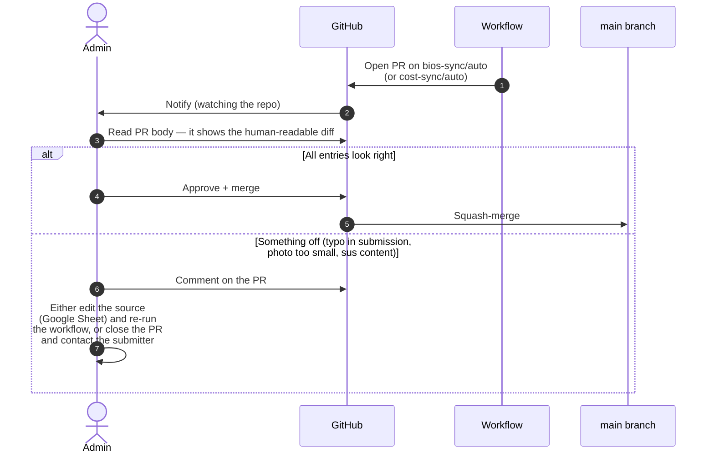

# Admin guide

> *Audience: site administrators (currently the Action Chair, Vice-Chair,
> and the maintainer). Covers what you own, where to log in, and how
> to do common tasks.*

This guide is the answer to: *"It's six months later, the maintainer
is on parental leave, something needs editing — where do I start?"*

> **Working with Claude Code in this repo?** The standing rules
> (British English, no machine translation, auto-merge by default,
> release-notes carve-out, the *open-an-issue-for-every-deferred-item*
> policy) are at [`CLAUDE.md`](../CLAUDE.md) in the repository root.
> Claude reads it automatically on every session. Edit it via PR
> when a rule shifts.

## Accounts and assets

A snapshot of every external account or asset the site depends on.
Keep this current as roles change.

### Domain and DNS

| Asset                | Location                                                | Owner / login                              | Notes                                                                                |
| -------------------- | ------------------------------------------------------- | ------------------------------------------ | ------------------------------------------------------------------------------------ |
| `netsec-cost.eu`     | **Namecheap**                                           | Registered under **Dr Moritz Weiss** (Action Chair); admin contact **Dr Arthur Laudrain** | `CNAME` file at repo root points GitHub Pages here. Renewal alarm should be on file. |
| GitHub Pages routing | `Settings → Pages` in the repo                          | GitHub org `EISSeuropa`                    | Source: `main` branch, root. Custom domain enforced (HTTPS).                          |
| TLS certificate      | Auto-managed by GitHub Pages (Let's Encrypt)            | n/a                                        | No action required unless DNS changes.                                                |

### Code and hosting

| Asset                                                        | Login                                                  | Who has access                              |
| ------------------------------------------------------------ | ------------------------------------------------------ | ------------------------------------------- |
| GitHub repo <https://github.com/EISSeuropa/netsec.github.io> | GitHub account, member of `EISSeuropa` org              | Action Chair, Vice-Chair, maintainer        |
| GitHub Actions (sync workflows)                              | Inherited from repo permissions                         | Same                                        |
| GitHub Pages deployment                                      | Inherited from repo permissions                         | Same                                        |
| Dependabot security alerts                                   | Repo `Insights → Dependency graph`                      | Same                                        |
| Branch & tag protection rulesets                             | Repo `Settings → Rules → Rulesets`                      | Read by all; edited by repo admin           |
| Automation PAT (for `release.sh` and any `gh api` work)      | <https://github.com/settings/personal-access-tokens>    | The maintainer; do not share                |

#### Branch & tag protection in place

Two repository rulesets enforce the boundary between routine and
catastrophic operations:

- **`protect-main`** — targets the default branch. Restricts
  deletions and force-pushes, requires linear history, requires a
  pull request with all four CodeQL checks green before merging,
  restricts merge methods to squash. **Bypass: Repository Admin**
  (so `scripts/release.sh` can push the changelog-promotion commit
  directly).
- **`protect-release-tags`** — targets tags matching `v*`. Restricts
  deletions, updates, and force-updates. **No bypass for anyone**,
  including admins. Release tags are immutable once published.

Both visible at
<https://github.com/EISSeuropa/netsec.github.io/settings/rules>.
For the rationale, see the PDF documentation pack, Section 07
("Branch and tag protection").

> **Bus-factor reminder.** Every admin task below assumes at least
> two people hold `EISSeuropa` org membership with `Maintain`
> permission on this repo, and at least one with the **Admin** role
> (required for cutting releases). If either drops to one, escalate.

### Bios pipeline (Google Form → Sheet → repo)

| Asset                              | Login                       | Notes                                                                                          |
| ---------------------------------- | --------------------------- | ---------------------------------------------------------------------------------------------- |
| Google Form "Join the NetSec network" | Google account that owns the form | URL: see `scripts/bios-source.json` → `form_url`. Set up per [`bios-setup.md`](./bios-setup.md). |
| Linked Google Sheet                | Same Google account         | The form's *Responses → Link to Sheets* destination. Publish-to-web is enabled (CSV).          |
| Published CSV URL                  | n/a (public)                | Stored in `scripts/bios-source.json` → `csv_url`. It's a public capability URL (anyone with it can read the Sheet as CSV), not a credential — the form's required-consent step is what gates what reaches it. |
| Country dropdown source            | Apps Script bound to the form | One-off script that bulk-loaded ~200 countries into question #4. See `bios-setup.md`.         |

### Contact form (Formspree)

| Asset                               | Login                                  | Notes                                                                  |
| ----------------------------------- | -------------------------------------- | ---------------------------------------------------------------------- |
| Formspree project (id `meenwyrb`)   | Formspree account that owns the project | Free tier; submission destination is the Action mailbox. ID is public. |

### Branding and visual identity

| Asset             | Location                                              | Licence                                                                              |
| ----------------- | ----------------------------------------------------- | ------------------------------------------------------------------------------------ |
| COST logo         | `assets/images/cost-logo.jpg`                         | © COST Association — used per COST visual-identity guidance for funded Actions       |
| EU emblem         | Inlined SVG in every page footer                      | Used per the [EU visual identity manual](https://commission.europa.eu/communication/visual-identity-and-branding_en) for *Funded by the EU* communication |
| NetSec logo       | Lockups + mark in `assets/images/brand/` (favicon family derived from the mark) | © COST Action NetSec                                              |
| Member headshots  | `assets/images/people/<slug>.{jpg,png,jpeg,webp}`     | © the individual member, displayed with their consent                                |
| Country flags     | <https://flagcdn.com> (loaded at runtime)             | Flags themselves public domain; CDN MIT                                              |

#### Maintaining brand assets

The visual identity is PNG assets, not CSS, since v1.8.0. Three update
paths, by what changes:

- **A brand colour.** Edit `--accent` / `--accent-2` in
  `assets/css/site.css` and `theme_color` in `manifest.webmanifest`,
  then run `python3 scripts/inject-seo.py` to refresh the cache-bust
  hashes. The structured-data `theme-color` reads the same value.
- **The mark or a lockup.** Drop the designer's new PNGs into the
  source folder, run `python3 scripts/build-brand-assets.py` (crops the
  lockups and regenerates the favicon family), then
  `python3 scripts/update-brand-html.py` if any markup paths change,
  then `python3 scripts/inject-seo.py`, and spot-check all three
  locales. Both brand scripts are one-shot and run locally, not in CI.
- **A social card.** Replace `assets/images/og-image.png` (general) or
  `assets/images/og-image-people.png` (directory) in place. These are
  hand-designed and deliberately not auto-generated.

The developer-facing index of which asset goes where is in
[`docs/design-system.md`](design-system.md); the public-facing rules
live in the press kit.

### Third-party CDNs loaded at runtime

These don't need accounts — listed so admins know what makes
network calls when someone loads the site.

| Service        | What it serves               | Privacy implication                                                                   |
| -------------- | ---------------------------- | ------------------------------------------------------------------------------------- |
| Google Fonts   | Inter + Lexend webfonts      | IP + UA logged by Google; declared in `privacy.html`.                                 |
| FlagCDN        | Country flag PNGs            | IP + UA logged by FlagCDN; declared in `privacy.html`.                                |
| Formspree      | Contact-form POST endpoint   | Only on submit. Acts as data processor under SCC; declared in `privacy.html`.         |

## Routine admin tasks

### Reviewing a weekly sync PR

Both sync workflows open PRs against `main` on the branches
`bios-sync/auto` and `cost-sync/auto`. Either may be empty most
weeks.



**Soft-review policy.** We don't auto-merge — every new bio passes
through a human's eyes. The reviewer's job is **not** to fact-check
research claims; it's to catch:

- obvious typos (e.g. ALL-CAPS surnames, missing capitals)
- broken or mis-targeted links (ORCID under the LinkedIn field)
- photos that aren't headshots
- anyone who didn't tick the consent checkbox (sync drops these
  automatically, but worth double-checking)

### Manually triggering a sync

When you can't wait for Monday morning:

1. Go to *Actions* in the GitHub repo.
2. Pick `Sync member bios from Google Form` or
   `Sync WG membership from cost.eu`.
3. Click **Run workflow** → **main** → **Run**.
4. Watch the run; if it opens a PR, review and merge.

### Removing a member at their request

1. Open `data/bios.json` (or the PR if a sync just added them).
2. Delete the relevant `members[]` entry.
3. Delete the headshot at `assets/images/people/<slug>.jpg` if present.
4. **Lock the source.** Open the Google Sheet and either:
   - delete the row (cleanest), or
   - clear the consent column → next sync drops them anyway.
5. Commit with message `bios: remove <slug> on request`.

### Updating the MC roster

Use only when cost.eu hasn't caught up yet:

1. Edit `data/mc-members.json` directly — add/remove the person.
2. Edit the country-grid block in `index.html` — same change.
3. PR + merge.
4. Next `sync-bios.py` run will use the new roster when auto-tagging
   "MC member · Country" on form submissions.

### Editing static page copy

No tooling required:

1. `git checkout -b copy/<short-description>`.
2. Edit the relevant `*.html` file.
3. Preview locally: `python3 -m http.server 8000` → open
   <http://localhost:8000>.
4. Open a PR. Merge once review is in.

GitHub Pages rebuilds in ~30 seconds after merge.

### Setting up a conference on Indico (ESSC and future editions)

A few one-off steps on the Indico event reduce the recurring email
load described in [#332](https://github.com/EISSeuropa/netsec.github.io/issues/332).
The public guidance for panelists lives in the FAQ *At a NetSec
conference* section; these are the organiser-side actions that back
it up.

1. **Give chairs editing rights over their own session.** Being listed
   as a session convener is display-only and carries no rights. The
   fastest grant is the bulk one: *Participant Roles → Privileges →
   Modification rights → **Grant modification rights to all session
   conveners***. With that, every chair, from *My Sessions* on the
   event page, can reorder talks, adjust timing, **and edit each
   contribution's content** (title, description, speakers, and author
   affiliations). Verified against the live ESSC 2026 event: a chair
   logged in this way sees *My Sessions* and the full *Edit
   contribution* dialog for every talk in their panel. The per-session
   alternative is *Sessions → shield icon → Coordination* plus the
   *Session coordinator rights* toggles, but the bulk grant is simpler.
   Re-apply each edition; it is not inherited. This makes the chair the
   reliable correction route for the whole panel, which is what the FAQ
   tells panelists.
2. **Optionally let authors self-edit their own contribution.** Turn on
   *Contributions → Settings (gear) → Submitter privileges → **Edit
   (basic)*** (lets submitters edit title, description, speakers, and
   authors; *Edit (custom)* is harmless to leave on). Then grant the
   submitter role with *Participant Roles → Privileges → **Submission
   rights*** so authors actually hold it on their contribution. Authors
   then edit under *My Contributions*. Two limits to know. The **Call
   for Abstracts** pencil greys out once a paper is accepted: that is
   the abstract, which stays locked by design, whereas the
   **contribution** is what is editable and what feeds the programme
   (name and affiliation ride on the per-event author record, so a
   personal-profile change does not propagate). And authors **without
   an Indico account** (the *N users with no Indico account* warning on
   the Participant Roles page) cannot self-edit at all, so they fall
   back to their chair or the contact form. Because of those two
   limits, treat author self-edit as a convenience on top of the chair
   route in step 1, not the primary path.

   **Deep-links for the FAQ.** Indico exposes per-user shortcuts that
   skip the menu hunt, so the FAQ links them directly:
   `https://indico.eiss-europa.com/event/<event-id>/contributions/mine`
   (a speaker's own contributions) and
   `…/event/<event-id>/sessions/mine` (a chair's own sessions). For
   ESSC 2026 the event id is `22`. These are per-edition, so swap the
   id and refresh the two FAQ links (`essc-edit-details`, `essc-chair`)
   each year. Both were checked on the live event: a speaker reaches
   the editable contribution, a chair reaches *My Sessions*. To change
   a name or affiliation the speaker opens the contribution, finds
   themselves in the *People* section, and clicks the small pencil
   beside their name, then edits the affiliation. That pencil is a few
   clicks deep, so the FAQ spells the path out.
3. **Invitation letters via document generation.** We issue visa
   invitation letters through Indico's document-generation module
   (decided for ESSC 2026). Build an HTML/Jinja template once under
   the event or category *Customisation → Document Templates* (admin
   right required), then bulk-generate from the registrations list
   (*Actions → Generate Documents*) and publish each letter to the
   registrant's own registration page for self-download. This keeps
   letters off the manual-drafting pile. The signatory is still to be
   confirmed (likely the Action Chair, Dr Moritz Weiss). The public
   FAQ answer stays signatory-agnostic until then, and the request
   channel for applicants remains the contact form. This template work
   is deferred to September 2026, tracked in
   [#374](https://github.com/EISSeuropa/netsec.github.io/issues/374).

### Canned replies for recurring panelist emails

Copy-paste responses for the emails that arrive every cycle, each one
pointing the sender at the FAQ answer that carries the full detail.
Keep them short and friendly. The matching public answers live in the
FAQ *At a NetSec conference* section. These carry the event id and the
`essc-<year>` URLs, so they are part of the per-edition rollover below.

**Correcting a name, affiliation, or paper title** (FAQ `#essc-edit-details`)

> Thanks for flagging this. If you have an Indico account you can fix it
> yourself: open your talk under My Contributions
> (https://indico.eiss-europa.com/event/22/contributions/mine) and edit
> the title, or click the small pencil next to your name to change your
> affiliation. The pencil on the Call for Abstracts page is locked once
> a paper is accepted, which is normal, so edit the contribution
> instead. The full steps are at
> https://netsec-cost.eu/faq.html#essc-edit-details. If you would rather
> we make the change, just reply with the correction. Either way the
> website refreshes overnight, so it shows the next morning.

**Finding the printable or PDF programme** (FAQ `#essc-programme-pdf`)

> The official programme is a one-click download from the top of
> https://netsec-cost.eu/essc-2026.html (the Download programme (PDF)
> button). If you would rather print the page from your browser, it
> works well in Safari, but Chrome can cut the long programme short, so
> the download is the reliable option. More at
> https://netsec-cost.eu/faq.html#essc-programme-pdf.

**A chair wanting to reorganise their panel** (FAQ `#essc-chair`)

> As chair you can manage your own session directly. Open My Sessions
> (https://indico.eiss-europa.com/event/22/sessions/mine) to reorder the
> talks, adjust their timing, and correct any talk's title or author
> affiliations. Anything that reaches beyond your session, such as
> moving the panel to a different slot or changing the room, comes to
> us. Details at https://netsec-cost.eu/faq.html#essc-chair.

**A visa letter of invitation** (FAQ `#essc-visa`)

> Happy to help. Please reply with your full name exactly as it appears
> in your passport, your affiliation, the title of your contribution if
> you have one, and the dates you plan to attend, and we will prepare a
> letter of invitation. If your visa appointment is soon, say so and we
> will prioritise it. Background at
> https://netsec-cost.eu/faq.html#essc-visa.

### The downloadable programme PDF

The programme page offers a *Download programme (PDF)* button that
hands over the official, tailored conference programme. The file lives
at `assets/programme/eiss-2026-programme.pdf` and is supplied by the
EISS organisers. To refresh it for a new edition, replace that file
(keep the name, or update the `pdfFile` value in the three
`essc-2026*.html` renderers and the FAQ link) and the button picks it
up. The button label is localised EN/FR/DE; all three point at the same
file, since the official programme is one document.

**Why a download exists at all.** Chrome's interactive *Save as PDF*
truncates the long programme mid-document. The print preview itself
stops part-way through, so it is a Chrome print-fragmentation defect,
not a page-layout problem we can fix from CSS: by measurement no
element on the page is too tall to break, and headless Chrome paginates
the whole thing correctly. **Safari prints the page fine.** The
in-browser print stylesheet still works (panels expand, abstracts
drop), but the download is the reliable path for Chrome users. Tracked
in [#364](https://github.com/EISSeuropa/netsec.github.io/issues/364).

### Rolling over to next year's ESSC edition

Most of the site refreshes itself once `scripts/sync-indico.py` is
looking at the new event, but a handful of values are hand-edited and
carry the year or the Indico event id. This is the one place that lists
them, so a rollover is a find-and-replace plus the Indico-side steps in
*Setting up a conference on Indico* above.

**Indico URL templates.** Replace `<id>` with the new event's id (the
number in the Indico event URL once you have duplicated the event). For
ESSC 2026 the id is `22`.

- Event home and registration: `https://indico.eiss-europa.com/event/<id>/`
- A speaker's own talks (FAQ self-edit link): `https://indico.eiss-europa.com/event/<id>/contributions/mine`
- A chair's own sessions (FAQ chair link): `https://indico.eiss-europa.com/event/<id>/sessions/mine`

**What updates itself (do nothing).** The daily sync scopes to the
*Annual Conferences* category, not a fixed event, so `data/indico.json`,
the programme grid, `calendar.ics`, and the home-page event banner all
follow the new edition once it is the live one. The per-session and
per-contribution Indico URLs inside `data/indico.json` regenerate too.

**What to hand-edit.** Everything below carries `essc-2026`, the
conference dates, or `event/22`:

| Where | What to change |
| --- | --- |
| `essc-2026.html` + `.fr` + `.de` | Rename to `essc-<year>.*`. Inside each: the masthead title and dates, the `@page` running-header date string, the print-footer URL, the JSON-LD dates and venue, the `event/22/` registration links, and the three `pdfFile` paths. |
| `assets/programme/eiss-2026-programme.pdf` | Replace with the new official programme. Keep the filename to avoid touching the `pdfFile` references, or rename and update them in the three renderers and the FAQ. |
| `faq.html` + `.fr` + `.de` (*At a NetSec conference* section) | `essc-edit-details` and `essc-chair` deep-links (`event/22/...`), `essc-programme-pdf` (the PDF link, the *ESSC 2026* label, the page link), and `essc-visa` (the dates and venue). Bump the FAQ footer stamp. |
| `data/events.json` | `indicoEventId`, the `Registration:` URL in the description, the `url` block (`essc-<year>.*`), and the dates, location, and chairpersons. The co-located Summer School has its own `events.json` entry: update its dates and rebuild the feed with `python3 scripts/build-calendar.py`. |
| `summer-school.html` + `.fr` + `.de` | The Summer School page is co-located with the conference but is **not** year-suffixed, so edit it in place rather than renaming: the edition dates, the *This edition* year and host, the application-status pill and deadline, and the faculty roster (names, affiliations, and which two are scientific coordinators). Faculty who are NetSec members resolve to their directory cards by name, so no `data-slug` editing is needed. |
| `data/whats-new.json` | The `/essc-2026.html` links and the campaign reason, if the banner is run for the conference (it is off by default, see CLAUDE.md §14). |
| `sitemap.xml` + `sitemap.html` (+ FR + DE) | The `essc-2026` URL entry. Re-run `scripts/inject-seo.py` to regenerate `sitemap.xml`. |
| `scripts/indico_clean_duplicate.py` | The `PROTECTED_EVENTS` allow-list, so the rollover script refuses to touch the new live event. |
| `docs/admin-guide.md` (*Canned replies* above) | The `event/22/...` and `essc-2026` URLs inside the four reply templates. |

The stakeholder PDF pack (`docs/pdf/documentation.html`) also names
ESSC 2026, but it refreshes on the release cadence (CLAUDE.md §5.4),
not per-conference, so leave it to the next pack update.

**Indico-side steps** (off-repo, re-apply each edition): grant chairs
modification rights, optionally enable submitter *Edit (basic)* and
submission rights, and build the visa-letter document-generation
template. All three are in *Setting up a conference on Indico* above.
After Indico duplicates the previous event, run
`scripts/indico_clean_duplicate.py` to strip the copied contributions
while keeping the configuration (see `docs/indico-patch.md`).

After the edits, run `python3 scripts/check-i18n-drift.py` and
`./scripts/check-links.sh --internal` before opening the PR.

### Pinning the member spotlight

The home page can feature one member per week ([#341](https://github.com/EISSeuropa/netsec.github.io/issues/341)).
Rotation is automatic (`scripts/rotate-spotlight.py`, weekly via the
`spotlight-rotate.yml` workflow) and stays **dormant until at least
10 members are eligible** (a member needs a photo and a written bio),
so nothing renders while the network is small. To feature a specific
member next run (a new joiner, an award, a deliverable author), set
`"pinned": "<member-id>"` in `data/spotlight.json` and push; the
script features them and clears the pin. Do not hand-edit `current`
or `history`; let the script manage them. Gender is not part of the
rotation score by design, so the pin is also how you correct any
visible imbalance.

### Cutting a release

The release script handles the SemVer bump, the CHANGELOG promotion,
the annotated tag, and the GitHub Release publication in one pass:

```bash
./scripts/release.sh <X.Y.Z> "<short title>"
```

Five things to get right *before* running it (the fifth applies on
minor / major releases only):

1. **`[Unreleased]` follows the hybrid release-notes format** spelled
   out at the top of `CHANGELOG.md`. Concretely:

   - A one- to three-sentence **lede** in voice (what is this
     release *about*?).
   - Two to four **themed `### sub-sections`** carrying the actual
     narrative — prose intro per theme, with bullets inside only if
     the theme has multiple distinct pieces.
   - A canonical **`### Index of changes`** at the bottom with
     `#### Added` / `#### Changed` / `#### Deprecated` /
     `#### Removed` / `#### Fixed` / `#### Security` sub-headings
     (in that order, each appearing at most once).

   **Every PR that ships a user-visible change adds at least one
   bullet to `[Unreleased]` in the same PR** (`CLAUDE.md` §4). The
   bullet goes into the *existing* index sub-heading, never in a new
   one with the same name below it. Exempt: dependabot / Renovate
   PRs, the automated `indico-sync/auto` data refresh, and any
   internal-only commit (docs-only refresh, CI tooling, working-tree
   hygiene). The lede + themes are written at release-cutting time
   for minor / major releases only. That's the moment the maintainer
   reads back through the index and shapes it into a release story.

   The release script extracts `[Unreleased]` *verbatim* into the
   GitHub Release notes. Eyeball the body before confirming the
   prompt; whatever lives in `[Unreleased]` lands on the public
   release page.

2. **Self-policing tier**:

   - **Patch releases** (`1.x.y` with no headline feature) skip the
     lede + themes. Index only. People reading patch notes care
     about specifics, not narrative.
   - **Minor / major** releases get the full hybrid.
   - If you can't write a meaningful lede about a release, it's a
     patch. The format mirrors the actual significance.

3. **Title is 3–8 words, sentence case, no trailing punctuation.**
   The title flows into the CHANGELOG heading, the GitHub Release
   name, the release commit message, and the tag. Past titles:

   - v1.4.0: *Site-wide search, infrastructure and directory improvements*
   - v1.3.0: *Introducing FAQ and Glossary pages*
   - v1.2.0: *Press kit, directory tour, compact view*
   - v1.1.0: *Release tooling and PDF SemVer*
   - v1.0.0: *Initial public release*

4. **No hard wraps in prose.** Each prose paragraph, blockquote lede,
   and multi-line bullet in `[Unreleased]` must be a single source
   line. GitHub Releases renders markdown with the *break-on-newline*
   GFM variant — every soft `\n` becomes a `<br>` and forces the
   prose to render visibly narrow on the Releases page (even though
   it looks flowing on the `github.com` file view). One long line per
   paragraph keeps both renderings correct. Editor soft-wrap is fine;
   hard line-breaks inside a paragraph are not.

5. **For minor / major releases (`X.Y.0` / `X.0.0`) — cross-check
   five surfaces.** Skip on patch releases (`X.Y.Z` where `Z > 0`);
   they're scoped to small fixes. For each, ask *"did anything in
   this release change what this surface documents?"* and either edit
   in the same release or open a tracking issue.

   - **Roadmap** — `/roadmap.html` (+ FR + DE) and
     `docs/roadmap-2026.md`. Promote the just-shipped release from
     *In progress* → *Shipped*; confirm next planned release is
     still accurate; consider whether anything in *Under watch* is
     ready to promote.
   - **Sitemap** — `sitemap.xml` and `/sitemap.html` (+ FR + DE).
     Add any new pages. Re-run `scripts/inject-seo.py` if titles /
     canonicals / hreflang changed.
   - **Translations** — `python3 scripts/check-i18n-drift.py`
     should report zero drift before cutting. Manual update on FR
     / DE for any EN copy that moved.
   - **Repo docs + PDF** — the markdown docs under `docs/` and the
     stakeholder PDF doc-pack. Cover-bump the PDF every minor /
     major release; defer the section-level catch-up via an
     explicit "gap" appendix entry when needed (see
     `docs/pdf/documentation.html` v1.7.0 entry as the canonical
     example).
   - **Members' Wiki** — <https://github.com/EISSeuropa/netsec.github.io/wiki>.
     Public FAQ / Glossary are source-of-truth (the Wiki holds
     stubs); decisions log should record any structural rewrite
     or convention change; *Templates & press kit* should match
     `/press-kit.html`.

   The full version of this checklist, with the cadence reasoning,
   lives in [`CLAUDE.md`](../CLAUDE.md) §5.

The script prints `[Unreleased]` + the proposed tag/title and prompts
for `y` confirmation before publishing. That prompt is the last
moment to abort cleanly. Re-run with `--dry-run` to preview without
the prompt.

### Rotating the Formspree project

If submission volume hits the free-tier quota, or if we move to a
self-hosted alternative:

1. Create the new endpoint on the chosen provider.
2. Search the repo for `meenwyrb` — currently only in
   `index.html` and `privacy.html`.
3. Replace with the new endpoint ID / URL.
4. Update `privacy.html` if the processor changes (legal basis,
   SCC reference).
5. PR + merge.

## Escalation

If something breaks:

| Symptom                                               | First port of call                                              |
| ----------------------------------------------------- | --------------------------------------------------------------- |
| Site returns 404 / 500                                | <https://www.githubstatus.com>                                  |
| Sync workflow fails                                   | *Actions* tab → click the failed run → scroll to the red step   |
| Form submissions stop arriving                        | <https://formspree.io/forms/meenwyrb> dashboard                 |
| New bio doesn't appear after Monday's sync            | Check the Google Sheet (consent ticked? row present?) → manually trigger `Sync member bios` |
| Suspected security issue                              | Follow [`../SECURITY.md`](../SECURITY.md) — **do not open a public issue** |
| DNS / domain issue                                    | Registrar admin (TBC); GitHub Pages settings as a sanity check  |

## Handover checklist

When admin responsibility moves to a new person, walk through the
checklist in order. The branch-protection ruleset's bypass is keyed
to the repo `Admin` role, so the role transfer specifically needs
care — get this wrong and `release.sh` will start failing for
everyone.

### Access grants (new admin)

- [ ] Add them to the `EISSeuropa` org with **`Admin`** role on this
      repo (not `Maintain` or `Write`). This is what permits the
      `release.sh` bypass against the `protect-main` ruleset; without
      it they can still merge PRs but cannot cut releases.
- [ ] If a second person will stay on as a non-release-cutting
      maintainer, give them `Maintain` separately — the `Admin` role
      is for the release-cutter.
- [ ] Grant them ownership of the Google Form + linked Sheet.
- [ ] Grant them access to the Formspree project (or migrate the
      project to their account).
- [ ] Make sure they have edit rights to the DNS registrar entry
      for `netsec-cost.eu`.

### Automation handover

- [ ] If automation tooling (`release.sh`, `gh api` scripts) is to
      keep running, provision a fresh PAT in the new admin's name
      with these Repository permissions on this repo:
      `Contents: read+write`, `Pull requests: read+write`,
      `Issues: read+write`, `Workflows: read+write`,
      `Administration: read+write`. Verify by listing rulesets:
      `gh api /repos/EISSeuropa/netsec.github.io/rulesets`.
- [ ] Once the new admin has verified the rulesets are visible and
      correct via the API listing above, **downgrade
      `Administration` to `Read` only**. This is the least-privilege
      steady-state: the token can still inspect rulesets (useful for
      future verification) but cannot create, modify, or delete
      them. Re-grant `Administration: read+write` temporarily only
      when a ruleset adjustment is actually needed (and prefer the
      Settings → Rules UI for one-off tweaks).
- [ ] Revoke the previous admin's PAT immediately after the new one
      is verified.

> **Why two-step on `Administration`.** The bypass that lets
> `release.sh` push the changelog-promotion commit through the
> `protect-main` ruleset is keyed to the user's *repository role*
> (`Admin`), not to the PAT's `Administration` permission. So
> downgrading the PAT to `Administration: Read` leaves the release
> pipeline working unchanged, while shrinking the blast radius of a
> leaked token: a compromised read-only token can no longer silently
> disable the rulesets that guard against catastrophic action.

### Verification

- [ ] Walk the new admin through this document and the
      [architecture overview](./architecture.md).
- [ ] Have them run `scripts/release.sh 0.0.0 --dry-run` from a
      synced `main`. Pre-flight should report
      *"✓ On main, clean, in sync with origin, v0.0.0 is fresh"*
      and stop there. (Nothing is changed by a dry-run.)
- [ ] Have them visit
      <https://github.com/EISSeuropa/netsec.github.io/settings/rules>
      and confirm both rulesets are listed as **Active**.

### Revocation (previous admin)

- [ ] Remove the previous admin's repo access. Their bypass capability
      against `protect-main` disappears the moment their `Admin` role
      is removed — verified by GitHub on every push.
- [ ] Remove or downgrade their org membership per policy.
- [ ] Update the **Owner / login** column above with the new owner.
