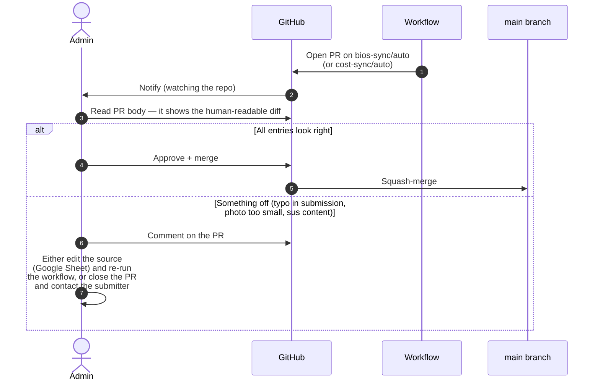

# Admin guide

> *Audience: site administrators (currently the Action Chair, Vice-Chair,
> and the maintainer). Covers what you own, where to log in, and how
> to do common tasks.*

This guide is the answer to: *"It's six months later, the maintainer
is on parental leave, something needs editing — where do I start?"*

## Accounts and assets

A snapshot of every external account or asset the site depends on.
Keep this current as roles change.

### Domain and DNS

| Asset                | Location                                                | Owner / login                              | Notes                                                                                |
| -------------------- | ------------------------------------------------------- | ------------------------------------------ | ------------------------------------------------------------------------------------ |
| `netsec-cost.eu`     | **Namecheap**                                           | Registered under **Dr Moritz Weiss** (Action Chair); admin contact **Dr Arthur Laudrain** | `CNAME` file at repo root points GitHub Pages here. Renewal alarm should be on file. |
| GitHub Pages routing | `Settings → Pages` in the repo                          | GitHub org `EISSeuropa`                    | Source: `main` branch, root. Custom domain enforced (HTTPS).                          |
| TLS certificate      | Auto-managed by GitHub Pages (Let's Encrypt)            | n/a                                        | No action required unless DNS changes.                                                |

### Code and hosting

| Asset                                                        | Login                                                  | Who has access                              |
| ------------------------------------------------------------ | ------------------------------------------------------ | ------------------------------------------- |
| GitHub repo <https://github.com/EISSeuropa/netsec.github.io> | GitHub account, member of `EISSeuropa` org              | Action Chair, Vice-Chair, maintainer        |
| GitHub Actions (sync workflows)                              | Inherited from repo permissions                         | Same                                        |
| GitHub Pages deployment                                      | Inherited from repo permissions                         | Same                                        |
| Dependabot security alerts                                   | Repo `Insights → Dependency graph`                      | Same                                        |
| Branch & tag protection rulesets                             | Repo `Settings → Rules → Rulesets`                      | Read by all; edited by repo admin           |
| Automation PAT (for `release.sh` and any `gh api` work)      | <https://github.com/settings/personal-access-tokens>    | The maintainer; do not share                |

#### Branch & tag protection in place

Two repository rulesets enforce the boundary between routine and
catastrophic operations:

- **`protect-main`** — targets the default branch. Restricts
  deletions and force-pushes, requires linear history, requires a
  pull request with all four CodeQL checks green before merging,
  restricts merge methods to squash. **Bypass: Repository Admin**
  (so `scripts/release.sh` can push the changelog-promotion commit
  directly).
- **`protect-release-tags`** — targets tags matching `v*`. Restricts
  deletions, updates, and force-updates. **No bypass for anyone**,
  including admins. Release tags are immutable once published.

Both visible at
<https://github.com/EISSeuropa/netsec.github.io/settings/rules>.
For the rationale, see the PDF documentation pack, Section 07
("Branch and tag protection").

> **Bus-factor reminder.** Every admin task below assumes at least
> two people hold `EISSeuropa` org membership with `Maintain`
> permission on this repo, and at least one with the **Admin** role
> (required for cutting releases). If either drops to one, escalate.

### Bios pipeline (Google Form → Sheet → repo)

| Asset                              | Login                       | Notes                                                                                          |
| ---------------------------------- | --------------------------- | ---------------------------------------------------------------------------------------------- |
| Google Form "Join the NetSec network" | Google account that owns the form | URL: see `scripts/bios-source.json` → `form_url`. Set up per [`bios-setup.md`](./bios-setup.md). |
| Linked Google Sheet                | Same Google account         | The form's *Responses → Link to Sheets* destination. Publish-to-web is enabled (CSV).          |
| Published CSV URL                  | n/a (public)                | Stored in `scripts/bios-source.json` → `csv_url`. It's a public capability URL (anyone with it can read the Sheet as CSV), not a credential — the form's required-consent step is what gates what reaches it. |
| Country dropdown source            | Apps Script bound to the form | One-off script that bulk-loaded ~200 countries into question #4. See `bios-setup.md`.         |

### Contact form (Formspree)

| Asset                               | Login                                  | Notes                                                                  |
| ----------------------------------- | -------------------------------------- | ---------------------------------------------------------------------- |
| Formspree project (id `meenwyrb`)   | Formspree account that owns the project | Free tier; submission destination is the Action mailbox. ID is public. |

### Branding and visual identity

| Asset             | Location                                              | Licence                                                                              |
| ----------------- | ----------------------------------------------------- | ------------------------------------------------------------------------------------ |
| COST logo         | `assets/images/cost-logo.jpg`                         | © COST Association — used per COST visual-identity guidance for funded Actions       |
| EU emblem         | Inlined SVG in every page footer                      | Used per the [EU visual identity manual](https://commission.europa.eu/communication/visual-identity-and-branding_en) for *Funded by the EU* communication |
| NetSec wordmark   | `NS` letter-mark — pure CSS, no asset                 | © COST Action NetSec                                                                 |
| Member headshots  | `assets/images/people/<slug>.{jpg,png,jpeg,webp}`     | © the individual member, displayed with their consent                                |
| Country flags     | <https://flagcdn.com> (loaded at runtime)             | Flags themselves public domain; CDN MIT                                              |

### Third-party CDNs loaded at runtime

These don't need accounts — listed so admins know what makes
network calls when someone loads the site.

| Service        | What it serves               | Privacy implication                                                                   |
| -------------- | ---------------------------- | ------------------------------------------------------------------------------------- |
| Google Fonts   | Inter + Lexend webfonts      | IP + UA logged by Google; declared in `privacy.html`.                                 |
| FlagCDN        | Country flag PNGs            | IP + UA logged by FlagCDN; declared in `privacy.html`.                                |
| Formspree      | Contact-form POST endpoint   | Only on submit. Acts as data processor under SCC; declared in `privacy.html`.         |

## Routine admin tasks

### Reviewing a weekly sync PR

Both sync workflows open PRs against `main` on the branches
`bios-sync/auto` and `cost-sync/auto`. Either may be empty most
weeks.

**Soft-review policy.** We don't auto-merge — every new bio passes
through a human's eyes. The reviewer's job is **not** to fact-check
research claims; it's to catch:

- obvious typos (e.g. ALL-CAPS surnames, missing capitals)
- broken or mis-targeted links (ORCID under the LinkedIn field)
- photos that aren't headshots
- anyone who didn't tick the consent checkbox (sync drops these
  automatically, but worth double-checking)

### Manually triggering a sync

When you can't wait for Monday morning:

1. Go to *Actions* in the GitHub repo.
2. Pick `Sync member bios from Google Form` or
   `Sync WG membership from cost.eu`.
3. Click **Run workflow** → **main** → **Run**.
4. Watch the run; if it opens a PR, review and merge.

### Removing a member at their request

1. Open `data/bios.json` (or the PR if a sync just added them).
2. Delete the relevant `members[]` entry.
3. Delete the headshot at `assets/images/people/<slug>.jpg` if present.
4. **Lock the source.** Open the Google Sheet and either:
   - delete the row (cleanest), or
   - clear the consent column → next sync drops them anyway.
5. Commit with message `bios: remove <slug> on request`.

### Updating the MC roster

Use only when cost.eu hasn't caught up yet:

1. Edit `data/mc-members.json` directly — add/remove the person.
2. Edit the country-grid block in `index.html` — same change.
3. PR + merge.
4. Next `sync-bios.py` run will use the new roster when auto-tagging
   "MC member · Country" on form submissions.

### Editing static page copy

No tooling required:

1. `git checkout -b copy/<short-description>`.
2. Edit the relevant `*.html` file.
3. Preview locally: `python3 -m http.server 8000` → open
   <http://localhost:8000>.
4. Open a PR. Merge once review is in.

GitHub Pages rebuilds in ~30 seconds after merge.

### Rotating the Formspree project

If submission volume hits the free-tier quota, or if we move to a
self-hosted alternative:

1. Create the new endpoint on the chosen provider.
2. Search the repo for `meenwyrb` — currently only in
   `index.html` and `privacy.html`.
3. Replace with the new endpoint ID / URL.
4. Update `privacy.html` if the processor changes (legal basis,
   SCC reference).
5. PR + merge.

## Escalation

If something breaks:

| Symptom                                               | First port of call                                              |
| ----------------------------------------------------- | --------------------------------------------------------------- |
| Site returns 404 / 500                                | <https://www.githubstatus.com>                                  |
| Sync workflow fails                                   | *Actions* tab → click the failed run → scroll to the red step   |
| Form submissions stop arriving                        | <https://formspree.io/forms/meenwyrb> dashboard                 |
| New bio doesn't appear after Monday's sync            | Check the Google Sheet (consent ticked? row present?) → manually trigger `Sync member bios` |
| Suspected security issue                              | Follow [`../SECURITY.md`](../SECURITY.md) — **do not open a public issue** |
| DNS / domain issue                                    | Registrar admin (TBC); GitHub Pages settings as a sanity check  |

## Handover checklist

When admin responsibility moves to a new person, walk through the
checklist in order. The branch-protection ruleset's bypass is keyed
to the repo `Admin` role, so the role transfer specifically needs
care — get this wrong and `release.sh` will start failing for
everyone.

### Access grants (new admin)

- [ ] Add them to the `EISSeuropa` org with **`Admin`** role on this
      repo (not `Maintain` or `Write`). This is what permits the
      `release.sh` bypass against the `protect-main` ruleset; without
      it they can still merge PRs but cannot cut releases.
- [ ] If a second person will stay on as a non-release-cutting
      maintainer, give them `Maintain` separately — the `Admin` role
      is for the release-cutter.
- [ ] Grant them ownership of the Google Form + linked Sheet.
- [ ] Grant them access to the Formspree project (or migrate the
      project to their account).
- [ ] Make sure they have edit rights to the DNS registrar entry
      for `netsec-cost.eu`.

### Automation handover

- [ ] If automation tooling (`release.sh`, `gh api` scripts) is to
      keep running, provision a fresh PAT in the new admin's name
      with **at minimum** these Repository permissions on this repo:
      `Contents: read+write`, `Pull requests: read+write`,
      `Issues: read+write`, `Workflows: read+write`,
      `Administration: read+write` (the last one is what lets them
      manage rulesets). Verify by listing rulesets:
      `gh api /repos/EISSeuropa/netsec.github.io/rulesets`.
- [ ] Revoke the previous admin's PAT immediately after the new one
      is verified.

### Verification

- [ ] Walk the new admin through this document and the
      [architecture overview](./architecture.md).
- [ ] Have them run `scripts/release.sh 0.0.0 --dry-run` from a
      synced `main`. Pre-flight should report
      *"✓ On main, clean, in sync with origin, v0.0.0 is fresh"*
      and stop there. (Nothing is changed by a dry-run.)
- [ ] Have them visit
      <https://github.com/EISSeuropa/netsec.github.io/settings/rules>
      and confirm both rulesets are listed as **Active**.

### Revocation (previous admin)

- [ ] Remove the previous admin's repo access. Their bypass capability
      against `protect-main` disappears the moment their `Admin` role
      is removed — verified by GitHub on every push.
- [ ] Remove or downgrade their org membership per policy.
- [ ] Update the **Owner / login** column above with the new owner.
