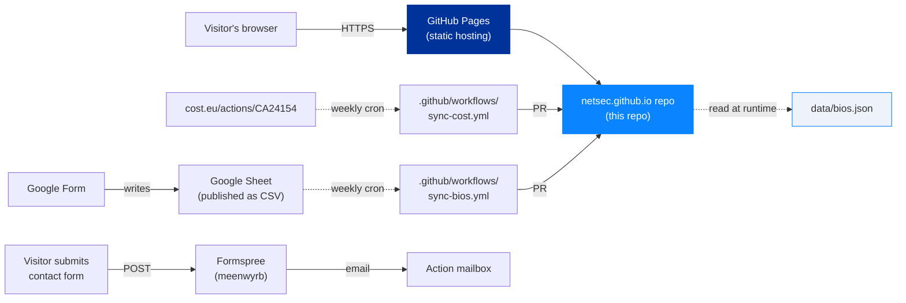
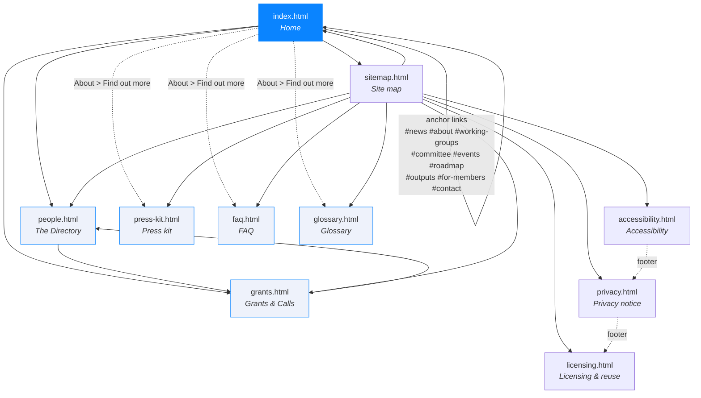
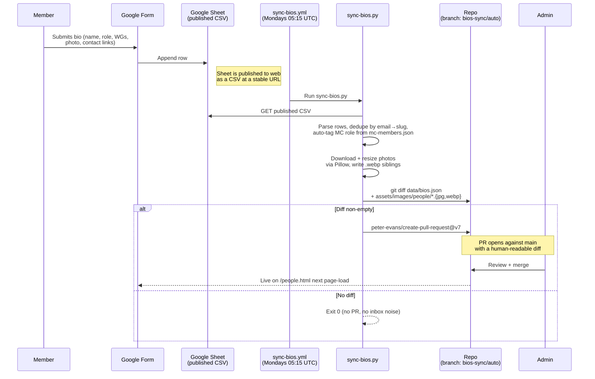
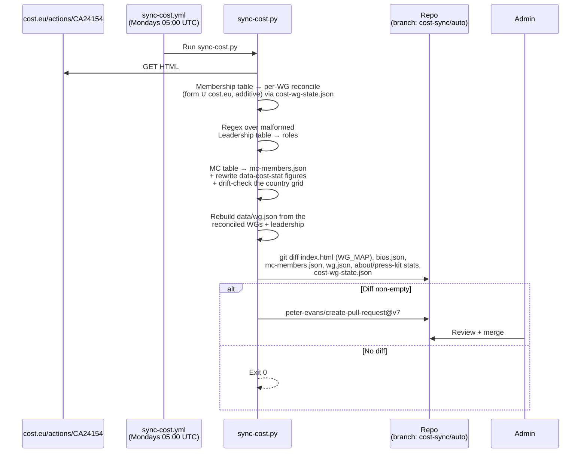
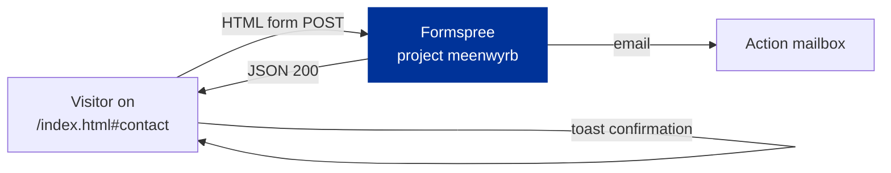
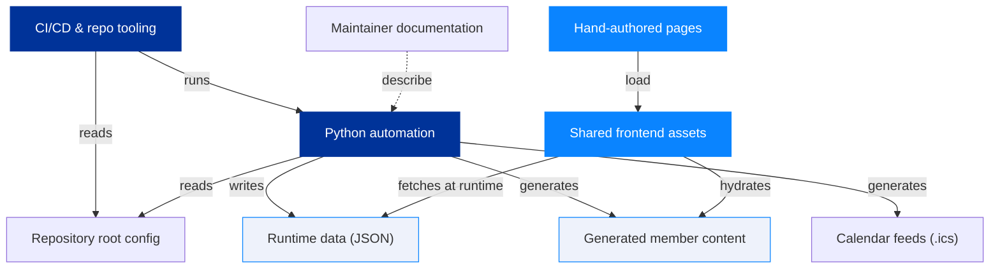

# Architecture

> *Audience: developers and maintainers who want to understand or
> extend the site.*

## Purpose

The NetSec website serves three distinct audiences with one
deliverable:

1. **The wider research community** — anyone working in or alongside
   European security studies. The site explains what the Action is,
   who's involved, what events are coming up, and how to engage.
2. **MC members, WG participants, and grant applicants** — practical
   resources: grant calls, e-COST workflow, deliverables, roadmap.
3. **External evaluators and funders** — COST and the EU Commission,
   for whom the site is also **Deliverable D1** (open community
   directory) of the Action's MoU.

Anything we add or change should help at least one of these groups
without confusing the others.

## Tech stack at a glance



- **No build step.** Every page is hand-authored HTML. The shared
  CSS and JS load directly from `assets/`.
- **No framework.** Vanilla browser APIs only.
- **No database.** Persistent state lives in `data/*.json`, committed
  to git.
- **No analytics or tracking.** Loading footprint is ~140 KB
  uncompressed including fonts.

## Site structure



| Page                  | Purpose                                                                         | Reads at runtime         |
| --------------------- | ------------------------------------------------------------------------------- | ------------------------ |
| `index.html`          | Action overview, audience-track strip (researcher / policy-maker / MC member / press routing, `docs/homepage-ia-phase2.md`), news, WGs, MC composition, events, *Find out more* discovery grid, *For NetSec members* Wiki signposting strip, contact. Roadmap and Outputs moved to their own pages in the Phase 1 IA pass. | `data/bios.json` (none — leadership baked in via `data-bios-roles`) |
| `people.html`         | Open community directory with WG/MC/country filters and the Join-the-network CTA| `data/bios.json` (full) |
| `grants.html`         | The five NetSec grant schemes, the e-COST timeline, resources, grant managers   | `data/bios.json` (Grant Awarding Coordinator cards) |
| `faq.html`            | 21 Q&As across six themed sections, with a jump-to TOC and per-question deep-link anchors. Migrated from the members' Wiki in website v1.3.0. | nothing |
| `glossary.html`       | ~35 COST and NetSec terms across five sections, with per-term deep-link anchors. Migrated from the members' Wiki in website v1.3.0. | nothing |
| `press-kit.html`      | Logos with pairing rules, colour palette, typography reference, funding-acknowledgement boilerplate (full / short / one-line), CC BY 4.0 attribution wording, do / don't rules. Added in website v1.2.0. | nothing |
| `sitemap.html`        | User-friendly site map linking every page and every in-page anchor              | nothing |
| `accessibility.html`  | WCAG 2.1 conformance statement                                                  | nothing |
| `privacy.html`        | GDPR-compliant privacy notice                                                   | nothing |
| `licensing.html`      | Dual-licence posture (MIT for code, CC BY 4.0 for prose) with the carve-outs spelt out. Split off from `privacy.html` §10. | nothing |

## Feature inventory

### User-facing

- **Light/dark theme toggle** with `prefers-color-scheme` default,
  manual override in `localStorage` (`netsec-theme`).
- **Reveal-on-scroll** powered by `IntersectionObserver`. Falls back
  to "always visible" if JS is disabled or the observer fails.
- **Glass cards** with `backdrop-filter`; graceful fallback under
  `@supports not (backdrop-filter)`.
- **Country flags** thumbnails via FlagCDN for every ISO country
  code (~200), used in the MC-by-country grid and member cards.
- **Network directory filters** — free-text search × WG/MC chip ×
  country dropdown, all AND-combined client-side.
- **Two view densities on the directory** — detailed (photo + bio
  + contact icons) and compact (one-row, flag + affiliation + WG
  chips). Switched via a segmented toggle in the toolbar; preference
  persists in `localStorage('netsec-directory-view')`.
- **Member preview panel** — in compact mode, clicking a card opens
  that member's detail in a side panel (a right rail on desktop, a
  bottom sheet on mobile) instead of expanding in place, so the grid
  never reflows and the visitor keeps their scroll position (#72,
  replacing the earlier expand-in-place). The panel content is a clone
  of the card's own detail body, so there is no second renderer; its
  "View full profile" link hands off to `/people/<slug>` for the bits
  the preview omits. Incoming `#slug` deep-links open the panel;
  `role="dialog"`, focus trap, focus returns to the card on close, Esc
  and click-outside (or the scrim, on mobile) dismiss. Expansion stays
  out of the URL so a shared `#themes=` filter survives tapping through
  members (#647).
- **First-visit orientation** — a dismissible welcome strip above
  the directory toolbar, plus a `?` button that re-opens an
  opt-in six-step guided tour (search → filter chips → country
  → density toggle → `+` quick-join → join card).
- **`+` quick-join button** in the directory toolbar — smooth-
  scrolls to the join card at the foot of the page and focuses
  the *Add your bio* CTA.
- **Bio collapse** — bios over 4 lines auto-detect and add a "Show
  more / Show less" toggle.
- **Member profile pages** — every member has a permanent,
  server-rendered page at `/people/<slug>` (+ FR/DE) with its own
  Open Graph card and `Person` JSON-LD. A hero band over a two-column
  body: bio + keywords + publications beside a sidebar of
  research-theme and region chips (each deep-linking to the directory
  filtered to that facet), a "works on similar topics" facepile of the
  members on the closest topics, an "In the EISS Anthology" link when
  the person is an Anthology author, and a gold prize pill for a
  European Security Studies Prize winner. The mentor and STSM-hosting
  badges are actionable here (a prefilled `mailto:`). Built by
  `scripts/build-profile-pages.py`; see
  [`profile-pages.md`](./profile-pages.md).
- **Research-theme + region filters are URL-addressable** —
  `/people.html#themes=a,b` and `#regions=x` open the directory
  pre-filtered and the active filters round-trip into the address bar,
  so a filtered view is shareable and a profile chip can deep-link into
  it.
- **Awarding-process timeline** on `grants.html` — numbered nodes on
  a gradient rail with Before / During / After pills.
- **e-COST portal model** spelt out on `grants.html`: the portal is
  a single general COST surface that NetSec cannot customise. It
  filters visibility by applicant profile (ITC only to ITC
  affiliates, YRIG only to under-40s), so an applicant might not
  see every scheme listed. The portal can also surface grant types
  from other COST programmes that NetSec hasn't budgeted for;
  applications for anything outside the Work and Budget Plan are
  rejected by the Grant Awarding Coordinator. The Grants page sets
  expectations openly so members don't apply for what we can't
  fund.
- **Site-wide search** powered by [Pagefind](https://pagefind.app/).
  A modal overlay triggered by Cmd/Ctrl-K, `/` (anywhere outside
  an input), or the magnifying-glass button in the nav. Indexes
  every `<main data-pagefind-body>` across all 30 public pages
  (EN + FR + DE); results are scoped to the visitor's active
  locale automatically. Each `<h1>`/`<h2>`/`<h3>` becomes a
  sub-result with a deep-link anchor — searches against long
  pages like FAQ and Glossary jump straight to the matched
  section. Lazy-loaded on first overlay open. Queries never
  leave the visitor's browser; the index is served from
  `/pagefind/` on the same origin. Keyboard navigation, focus
  trap, `aria-live` result count, full light + dark theme
  parity. Directory members are indexed through per-member stub
  pages (`search/bios/<lang>/<slug>.html`, one per locale) that
  `build-bio-search-stubs.py` renders from `data/bios.json`, carrying
  the country and Working-Group facets so a member is findable by
  name and filterable by WG. Both syncs regenerate the stubs, and
  `data-shape-check.yml` fails on any drift, so a member added or
  moved between WGs never silently drops out of search (#1218, #1428).

### Operator-facing

- **Two weekly sync workflows** (see below) that open PRs rather
  than silently pushing to `main`.
- **`data-bios-roles` runtime binding** — any HTML element with this
  attribute gets populated from `data/bios.json` at load, so the
  grant-manager cards on `grants.html` and the Action-leadership
  blurbs on `index.html` stay in step with the directory without
  duplicating data.
- **MC member auto-tagging** — `sync-bios.py` cross-references new
  submissions against `data/mc-members.json` and appends an
  `MC member · <Country>` role if the name matches. The roster
  itself is regenerated weekly by `sync-cost.py` from cost.eu's MC
  table.
- **Self-rewriting MC statistics** — the "MC representatives" and
  "countries represented" figures on `about.html` and `press-kit.html`
  (all locales) carry `data-cost-stat` markers that `sync-cost.py`
  rewrites from the parsed roster, so the visible numbers cannot drift
  from cost.eu. The hand-authored country grid on `about.html` is
  drift-checked (report-only) against the same roster.
- **Additive WG reconciliation** — a member's Working Group chips are
  reconciled per WG between their Google Form answer and cost.eu's
  formal record, biased towards additions (members add WGs more often
  than they drop them) and dated by observation clocks in
  `data/cost-wg-state.json`. A WG declared on the form but not yet on
  cost.eu is kept and flagged as pending; a deliberate removal is held
  for the maintainer. See `docs/bios-setup.md` for the full rule.
- **Brand-accurate social icons** — Simple Icons SVGs for ORCID
  (with the official green), LinkedIn, X, Bluesky, Mastodon.

## Data flow

### How a bio gets onto the site



### How a cost.eu change propagates



The home-page `WG_MAP` and `data/wg.json` both consume the *reconciled*
WG sets, so the WG chips on the home page, the directory, and the
Working Groups page always agree.

> **Why regex over the Leadership table?** cost.eu emits a malformed
> `</div>` where `</td>` should close — that breaks BeautifulSoup's
> table parser silently (only 5 of 14 roles come through). The
> regex falls back to the raw HTML and walks every `<td>…</td>`
> ending in a known leadership suffix (Chair, Coordinator, Leader,
> Co-Lead, Representative).

### How a contact-form submission flows



Formspree is the only third-party that ever sees visitor data
besides GitHub Pages' own access logs. The full processor list is in
[`privacy.html`](https://netsec-cost.eu/privacy.html).

### How the ESSC programme stays live

The annual conference page at `/essc-2026.html` (and FR / DE
variants) renders its programme grid from `data/indico.json`,
which is mirrored daily from the shared EISS Indico instance at
`indico.eiss-europa.com`. The full pipeline:

1. `scripts/sync-indico.py` runs at 03:45 UTC each day via
   `.github/workflows/sync-indico.yml`. It calls Indico's
   `/export/categ/1.json` and `/export/timetable/{event_id}.json`,
   normalises the response, and writes `data/indico.json`.
2. The script also patches `data/events.json` (entries with an
   `indicoEventId` field get `summary` / `start` / `end` overwritten
   from the same Indico payload, allow-list only) and regenerates
   `calendar.ics` so the home-page banner + the subscribable
   calendar feed stay in step with the live programme. See
   `docs/indico-sync.md` *Companion files* for the rationale.
3. When the data half of any output changed, the workflow opens (or
   updates) a pull request on `indico-sync/auto` via
   `peter-evans/create-pull-request`, labels it `automated`, and
   enables auto-merge with squash. CodeQL runs as a separate
   workflow on the bot PR, all four required checks complete, and
   auto-merge fires hands-free. Otherwise the working tree stays
   clean and the workflow is a no-op. (Direct push to `main` was the
   previous design; the v1.6.1 ruleset tightening made it
   incompatible. See the 2026-05-24 entry in the Wiki Decisions log.)
4. On every visit to `/essc-2026.html`, the shared renderer
   (`assets/js/essc-programme.js`, one file serving all three locale
   pages) fetches `data/indico.json`, picks the right year
   under `annualConferences`, and renders the day chips, time
   blocks, parallel sessions, and contributions.

The design rationale lives at
[`docs/indico-sync.md`](indico-sync.md) and (canonically) in the
EISS repository's `docs/indico-programme-integration.md`.

### The member-card popover and directory name matching

Several pages turn a person's name into a profile card without
duplicating the directory. One shared component lives in
`assets/js/site.js`, exposed as `window.netsecMemberCard` with
`show(anchorEl, member, opts)` and `hide()`. It builds a single
top-layer `<div popover>`, positions it against the anchor, and
renders the member's photo, affiliation, role badges, and a link
through to the full directory entry. The ESSC programme renderer
calls this shared component rather than carrying the ~250-line inline
copy it used to hold.

Pages resolve a name to a `data/bios.json` record with a normalised
first-and-last key: salutations (Dr, Prof) and nobiliary particles
(von, de, van) are dropped, diacritics are folded, and apostrophes
are stripped, so "Dr Silvia D'Amato" and "Silvia D'Amato" key the
same. The matcher is mirrored in `scripts/sync-bios.py` and
`assets/js/site.js`, and drives three surfaces: ESSC speaker links,
the Summer School faculty roster, and the About-page and
Working-Group leadership cards. Each resolves by name when no
explicit id or `data-slug` is present, so a card gains the person's
live headshot and profile link the first time they appear in the
directory, with no hand-editing. A `name_aliases` array on a bios
record covers the cases the key cannot reach, such as a nickname,
reversed name order, or a transliteration variant.

### The Summer School page

`/summer-school.html` (and FR / DE variants) is the NetSec
Early-Career Scholars Summer School (ECS³), run jointly with EISS.
It is a hand-authored page that reuses the hero, glass-card, and
`.mc-avatar` patterns. Its faculty roster renders a monogram per
scholar from static markup, then the `ecs-faculty` block in
`site.js` replaces the monogram with a live headshot for any faculty
member who resolves against the directory by name (the matcher
above). The EISS lockup is an inline SVG at
`assets/images/eiss-logo.svg`, kept inline so its `currentColor`
wordmark adapts to light and dark themes.

### The individual profile pages and cross-site links

`scripts/build-profile-pages.py` renders a static page per member per
locale into `/people/`, from `data/bios.json`, lifting the chrome from
the matching `people.*.html` shell so it never drifts. The page enriches
the member's record into a hero band over a two-column body (themes and
region chips that deep-link into the directory filter, a similar-people
facepile, the actionable mentor/STSM buttons, the recent-publications
list). It owns the `?v=` hashes on `people/*`, so it runs **after**
`inject-seo.py`, and a CI gate (`build-profile-pages.py --check` in
`data-shape-check.yml`) fails if the committed pages drift from a fresh
build.

Two cross-site links surface on the page, both joined on the canonical
name key (`name_key()`, shared with the EISS Anthology). The "In the
EISS Anthology" link is resolved at runtime by a small inline script
that matches the member against EISS's published `authors-index.json`,
the mirror of the `directory-index.json` NetSec itself publishes for the
reverse direction (`scripts/build-directory-index.py`). The gold prize
pill is rendered at build time from a curated `data/prize-winners.json`.
The full contract is in
[`cross-repo-workflow.md`](./cross-repo-workflow.md); the page anatomy is
in [`profile-pages.md`](./profile-pages.md).

## Code layers

The codebase falls into nine layers. The map below is the conceptual
summary that the file tree in the next section spells out in full. It is
derived from the interactive codemap, which reads the actual imports and
data flows out of the code, so it reflects how the parts really depend on
each other rather than how they happen to be filed.



Read it top to bottom as a pipeline. GitHub Actions workflows run the
Python tooling on a schedule, and that tooling regenerates the JSON data,
the per-member profile pages, and the calendar feeds. In the browser the
shared stylesheet and widgets fetch that JSON at runtime and hydrate the
generated pages, while the hand-authored pages pull in those same shared
assets. The maintainer docs sit to one side, describing the tooling
rather than being called by it.

The live, explorable version is at
[codemap.netsec-cost.eu](https://codemap.netsec-cost.eu/), a
hand-refreshed snapshot built with the Understand-Anything tool. When
this diagram and that snapshot disagree, one of them has gone stale,
which makes the codemap a useful cross-check during a documentation
sweep (rule §11).

## Repository layout

```
.
├── index.html                       # Home
├── people.html                      # The Directory
├── grants.html                      # Grants & Calls
├── faq.html                         # Public FAQ (21 Q&As, six sections)
├── glossary.html                    # COST + NetSec terminology (~35 terms)
├── press-kit.html                   # Logos, palette, funding acknowledgements
├── accessibility.html               # WCAG statement
├── privacy.html                     # GDPR notice
├── licensing.html                   # Dual-licence posture
├── sitemap.html                     # User-friendly site map
├── 404.html                         # Not-found page (locale-detecting)
├── {page}.fr.html                   # French beta of every page above (except 404)
├── {page}.de.html                   # German beta of every page above (except 404)
│
├── sitemap.xml                      # Machine-readable sitemap with hreflang siblings
├── directory-index.json             # Public cross-site contract: members keyed by name_key → profile URL (consumed by the EISS Anthology)
├── CNAME                            # GitHub Pages → netsec-cost.eu
├── lighthouserc.json                # Lighthouse CI budget assertions (perf/a11y/SEO + per-page image weight)
│
├── assets/
│   ├── css/site.css                 # Core stylesheet, loaded by every page
│   ├── css/directory.css            # Directory bundle: /people.html + the generated /people/<slug> pages only
│   ├── css/roadmap.css              # Roadmap bundle: /roadmap.html only
│   ├── js/site.js                   # Nav, theme, reveal-on-scroll, accordions, directory, member-card popover
│   ├── js/home-events.js            # Home Events block (renders from data/events.json)
│   ├── js/home-news.js              # Home News block (renders from data/news.json)
│   ├── js/home-spotlight.js         # Home member-spotlight strip (renders from data/spotlight.json)
│   ├── js/working-groups.js         # /working-groups.html (renders from data/wg.json + publications.json)
│   ├── js/roadmap-progress.js       # Roadmap progress bars (renders from data/roadmap-progress.json)
│   ├── js/roadmap-shipped-toggle.js # Roadmap "show earlier releases" collapse (shared EN/FR/DE; #725)
│   ├── js/essc-programme.js         # ESSC programme renderer (shared EN/FR/DE; extracted from inline #725)
│   ├── js/outputs-publications.js   # /outputs.html publications list (shared EN/FR/DE; renders publications.json, #726)
│   ├── images/people/*.{jpg,png,webp} # Member headshots + WebP siblings (sync-bios)
│   ├── images/cost-logo.jpg         # COST logotype
│   ├── images/og-image.png          # Open Graph card (1200 × 630)
│   └── images/logo.png              # Favicon / NS mark
│
├── data/
│   ├── bios.json                    # The directory (members, roles, WGs, contacts)
│   ├── mc-members.json              # MC roster per country, generated by sync-cost from cost.eu's MC table; read by sync-bios for MC auto-tagging
│   ├── cost-wg-state.json           # WG-reconciliation observation clocks for sync-cost (generated; never hand-edited)
│   ├── wg.json                      # Per-WG leadership + membership, generated by sync-cost; drives /working-groups.html
│   ├── i18n-state.json              # SHA-1 stamps for translation-drift tracking
│   ├── events.json                  # Authoritative source for /calendar.ics + /calendar/<slug>.ics + Events cards
│   ├── publications.json            # Action outputs, WG-tagged. Drives /outputs.html + WG-page "Related publications"
│   ├── field-guide.json             # Field-guide concept entries; rendered into the glossary's "Concepts in European security studies" section by build-field-guide.py (#766)
│   └── prize-winners.json           # Directory members who won the European Security Studies Prize, keyed by member id; renders the gold prize pill on the full profile page (build-profile-pages.py)
│
├── calendar/                        # Per-event .ics downloads (auto-generated)
│   └── <slug>.ics                   # One file per event in events.json; powers per-card "Add to calendar" buttons
│
├── pagefind/                        # Built at deploy time, not committed (gitignored)
│
├── scripts/
│   ├── sync-cost.py                 # Weekly cost.eu sync: WG_MAP, leadership, MC roster + stats, per-WG WG reconciliation
│   ├── sync-bios.py                 # Pulls Google Form submissions
│   ├── bios-source.json             # CSV URL + form URL + column mapping
│   ├── inject-seo.py                # Idempotent canonical/OG/JSON-LD generator + asset cache-bust stamper (?v=hash); run before the profile/sitemap builders
│   ├── build-profile-pages.py       # Server-renders /people/<slug>.{html,fr,de} from bios.json: enriched profile (themes/regions, similar-people facepile, mentor/STSM CTAs, prize pill, runtime anthology link); owns people/* ?v=, run LAST; --check drift gate (#762)
│   ├── build-directory-index.py     # Generates directory-index.json, the cross-site contract published for the EISS Anthology (members keyed by name_key → profile URL); --check drift gate
│   ├── build-sitemap.py             # Regenerates sitemap.xml from the top-level page list + the committed profile pages; --check drift gate
│   ├── build-og-cards.py            # Headless-Chrome per-member OG card PNGs (1200×630) from bios.json; churn-free manifest; --check gate (see og-cards.md, #1023)
│   ├── build-brand-assets.py        # One-shot: crop designer lockups + rasterise the favicon family into assets/images/brand/ (not in CI)
│   ├── update-brand-html.py         # One-shot: migrate favicon/logo markup across all HTML to the brand set (not in CI)
│   ├── check-i18n-drift.py          # Reports stale translations vs. EN source (ignores cache-bust query)
│   ├── i18n-diff.py                 # Translator helper: EN prose blocks changed since the last fresh-mark (#728)
│   ├── check-data-shape.py          # Shape-validates synced data/*.json (would-this-blank-a-page invariants); CI gate (#724)
│   ├── check-render-smoke.sh        # Headless-Chrome render smoke of the runtime-rendered pages; CI gate (#724)
│   ├── check-a11y-statement-date.py # Fails when accessibility.html's "next scheduled review" date has passed
│   ├── build-calendar.py            # Generates /calendar.ics + /calendar/<slug>.ics from data/events.json
│   ├── build-news-rss.py            # Generates /news.xml (RSS 2.0) from data/news.json
│   ├── build-field-guide.py         # Renders data/field-guide.json into the glossary "Concepts" section (EN/FR/DE), sentinel-scoped; --check drift gate (#766)
│   ├── build-network-map.py               # Regenerates data/network-map.json (theme hubs, mentorship flags, headshots) from bios.json + wg.json + every conference programme (indico.json + each frozen essc-<year>-programme.json) for the NetSec Network Map page; --check drift gate (see network-map.md, #764, #1584)
│   ├── sync-roadmap-progress.py     # Writes data/roadmap-progress.json from GitHub milestone closed/total
│   ├── build-search.sh              # Builds /pagefind/ via `npx pagefind` (gitignored)
│   ├── build-bio-search-stubs.py    # Renders search/bios/<lang>/<slug>.html — the per-member stubs Pagefind indexes so a member is findable by site search (country + wgs facets); --check drift gate (#1218, #1428)
│   ├── summarise-sync-changes.py    # Reads the working tree after the sync generators run; prints the one-line "what actually changed" summary that leads each sync PR body (#1427)
│   ├── social-post.py               # Composes + publishes news / spotlight / thread posts to Bluesky + LinkedIn (see social-publishing.md, #1072)
│   ├── rotate-spotlight.py          # Picks the weekly home-page member spotlight by balanced-rotation score; writes data/spotlight.json (#341)
│   ├── check-linkedin-version.py    # Keeps data/linkedin-api-version.json current vs. LinkedIn's published active versions, so the LinkedIn-Version header never sunsets silently (see social-publishing.md, #1223)
│   ├── release.sh                   # Cuts a tagged release; promotes CHANGELOG
│   └── requirements.txt             # requests, beautifulsoup4, Pillow
│
├── .github/workflows/
│   ├── pages-deploy.yml             # Build → deploy on push-to-main (builds /pagefind/ here)
│   ├── sync-cost.yml                # Weekly cron — opens PR on any cost.eu change (WG_MAP, leadership, MC roster, stats, reconciled WGs); reruns every bios-derived generator incl. search stubs; PR body leads with a one-line change summary
│   ├── sync-bios.yml                # Daily cron — opens PR if bios.json changed; reruns every bios-derived generator (profile pages, OG cards, search stubs, sitemap, index, network map, field guide); PR body leads with a one-line change summary
│   ├── spotlight-rotate.yml         # Weekly cron (Tue 10:00 Europe/Paris) — rotates data/spotlight.json and posts the spotlight to Bluesky + LinkedIn, ungated (#341, #1072)
│   ├── social-bluesky.yml           # Approval-gated news / thread posting to Bluesky + LinkedIn on a news.xml change or manual dispatch (#1072)
│   ├── linkedin-version-check.yml   # Monthly cron — bumps data/linkedin-api-version.json before LinkedIn sunsets the pinned API version; auto-merging PR (#1223)
│   ├── i18n-drift.yml               # Drift checker for FR/DE translations
│   ├── seo-asset-check.yml          # SEO drift + asset cache-bust drift (inject-seo.py --check)
│   ├── calendar-drift.yml           # Drift checker for /calendar.ics + /calendar/*.ics vs. events.json
│   ├── news-drift.yml               # Drift checker for /news.xml vs. data/news.json
│   ├── roadmap-refresh.yml          # Daily: the [Unreleased] autostamp + data/roadmap-progress.json
│   ├── external-link-arrows.yml    # Lint: trailing → on external links
│   ├── search-drift.yml             # Build sanity check on PRs (per-locale page count > 0)
│   ├── data-shape-check.yml         # Shape lint + headless render smoke on data/** PRs; runs the --check drift gates (profile pages, sitemap, directory index, network map, OG cards, bio search stubs) (#724, #1428)
│   ├── launch-qa-link-check.yml     # Internal+external link check + a11y-statement review-date check (weekly + root-HTML PRs)
│   └── lighthouse.yml               # Lighthouse budget assertions per lighthouserc.json on HTML/CSS/JS PRs (#270; non-required)
│
├── docs/                            # ← you are here
│   ├── README.md                    # ToC for this folder
│   ├── architecture.md              # this file
│   ├── design-system.md
│   ├── admin-guide.md
│   ├── i18n.md                      # Translation workflow + drift conventions
│   ├── seo.md                       # SEO injector design, OG/JSON-LD schema
│   ├── profile-pages.md             # The enriched /people/<slug> pages + the cross-site member/author links
│   ├── network-map.md                     # The NetSec Network Map prototype: the network map + how build-network-map.py derives its graph
│   ├── cross-repo-workflow.md       # NetSec ↔ EISS conventions, incl. the directory-index/authors-index contract
│   ├── bios-setup.md                # One-time Google Form set-up guide
│   ├── pdf/                         # Source for the documentation pack
│   │   ├── documentation.html       # Single-file source, rendered to PDF
│   │   ├── build.sh                 # Headless-Chrome → PDF builder
│   │   └── NetSec-website-documentation.pdf
│   └── promo/                       # Promotional poster (A3) and card-size variant
│
├── CHANGELOG.md                     # Keep a Changelog format, SemVer 2.0.0
├── LICENSE                          # MIT (code)
├── LICENSE-CONTENT                  # CC BY 4.0 (prose) with carve-outs
├── README.md                        # Project entry point
└── SECURITY.md                      # Coordinated-disclosure policy
```

## Naming and code conventions

- **British English** in all user-facing copy.
- **Slugs** are produced by `slugify()` in both Python sync scripts
  (must stay in lockstep): strip salutation prefix, drop diacritics,
  drop apostrophes, lowercase, replace anything not `[a-z0-9]` with
  `-`, collapse runs.
- **Member IDs** in `bios.json` are the slug of the cleaned name —
  stable across submissions, used as the DOM `id` on member cards
  so deep-links like `/people.html#arthur-laudrain` resolve.
- **Comments in CSS and JS** are full sentences explaining intent
  (why the code is there), not paraphrasing the code itself.
- **No JS framework, no transpiler, no bundler.** If a feature needs
  one, the bar is high — open an issue first.

## Extending the site

If you're adding a new page:

1. Copy a prose-page skeleton (e.g. `licensing.html` or `faq.html`) —
   either provides the canonical `<head>`, theme-FOUC script,
   ambience blobs, nav, and footer.
2. Decide whether the page belongs in the top nav (8 items today,
   the capacity rule in `docs/homepage-ia-phase2.md` keeps it flat
   through a 9th or 10th item and only groups into dropdowns at an
   11th). If not, signpost it via the home page's *Find out more*
   discovery grid at the end of the About section.
3. Create FR + DE beta siblings (`page.fr.html`, `page.de.html`).
   Translate chrome and content manually — no machine translation.
4. Add the page to `data/i18n-state.json` (the SHA-1 drift manifest)
   and run `python3 scripts/check-i18n-drift.py --mark-fresh page.html fr`
   (and `... de`) to stamp the translations.
5. Add the slug to the `PAGES` list in `scripts/inject-seo.py` and
   run it to inject canonical / OG / Twitter Card / JSON-LD blocks.
6. Add the page (with `<xhtml:link>` siblings for FR/DE) to
   `sitemap.xml`, and list it in `sitemap.html` (+ FR/DE) under the
   right branch.
7. Add a footer link on every other page (`grep` for an existing
   footer-link pattern and replicate it across the 24 page × locale
   permutations).
8. Mark the new page's searchable content with `data-pagefind-body`
   on the `<main>` element so the Pagefind indexer picks it up.
   You don't need to commit anything under `/pagefind/`: the index
   is built fresh on every deploy by `.github/workflows/pages-deploy.yml`
   and `/pagefind/` itself is gitignored. `search-drift.yml` runs on
   every PR that touches HTML and verifies the build succeeds with
   non-zero per-locale page counts — so a forgotten `data-pagefind-body`
   marker or a regression in `scripts/build-search.sh` is still caught.
   To preview a content change with working search locally, run
   `./scripts/build-search.sh` and serve the working tree
   (`python3 -m http.server`); the result is gitignored.
9. Bump the version stamp in the page meta-strip if you're adding
   a privacy- or accessibility-relevant page.

If you're adding a new field to `bios.json`:

1. Add the question to the Google Form.
2. Add the column to `scripts/bios-source.json` → `columns`.
3. Add the field to `_make_seed_entry()` and to the form-row parser
   in `scripts/sync-bios.py`.
4. Render it where it should appear (`people.html`,
   `index.html` if leadership, `grants.html` if grant manager).
5. Update `docs/bios-setup.md` so the next admin doesn't have to
   reverse-engineer the change.

If you're changing the brand assets (logo, mark, favicon, colours):

1. Brand updates run **outside CI**, with one-shot local scripts. For a
   new mark or lockup, drop the designer PNGs into the source folder and
   run `scripts/build-brand-assets.py` (crops the lockups, regenerates
   the favicon family), then `scripts/update-brand-html.py` if markup
   paths change.
2. Run `scripts/inject-seo.py` afterwards so the structured-data
   `Organization.logo` (`assets/images/brand/android-chrome-512.png`)
   and the cache-bust hashes stay in sync.
3. For a colour change, edit `--accent` / `--accent-2` in `site.css` and
   `theme_color` in `manifest.webmanifest`, then re-run `inject-seo.py`.
4. See `docs/design-system.md` for which asset goes where and
   `docs/admin-guide.md` for the full maintenance procedure.

If you're adding a new event to the Events section:

1. **Add the structured form to `data/events.json`.** This is the
   single source of truth for the public `/calendar.ics` feed and
   for the per-event `/calendar/<slug>.ics` downloads.
   - `uid`: stable identifier of the form `<slug>@netsec-cost.eu`
     so subscribers don't get duplicate events on later edits. The
     `<slug>` half also becomes the per-event filename
     (`/calendar/<slug>.ics`), so it must match `^[a-z0-9-]+$` —
     the generator refuses non-conforming slugs.
   - `start` / `end`: ISO-8601 local time in the format
     `YYYY-MM-DDTHH:MM` (no timezone suffix — the file-level
     `tzid` attaches the zone).
   - Update the top-level `dtstamp` field to today (any edit
     counts as a republication of the feed under RFC 5545).
   - Escape sequences are handled by the generator — write commas
     and apostrophes naturally in the JSON.
2. **Regenerate the .ics files**: `python3 scripts/build-calendar.py`.
   That writes the aggregate `/calendar.ics` (subscribable feed)
   *and* one `/calendar/<slug>.ics` per event (one-shot "Add to
   calendar" downloads). Removing an event from JSON deletes the
   matching per-event file automatically. CI
   (`.github/workflows/calendar-drift.yml`) runs the same script
   with `--check` on every PR and fails if any output would change
   — so you can't merge an `events.json` edit without regenerating.
3. **Add the card-display fields to the same `events.json` entry.**
   Since v1.9.0 the home-page Events section renders at runtime from
   `data/events.json` via `assets/js/home-events.js`. The renderer
   reads `cardTitle`, `cardDescription`, `meta[]`, and `cta`, plus
   `eventType` / `featured` / `displayDate`, each carrying an
   `{en, fr, de}` block where the copy is locale-specific. The
   hand-coded `<article class="event-card">` markup in `index.html`
   (and the FR + DE siblings) now survives only as a fail-soft
   fallback that the renderer empties on success, so you no longer
   hand-author one card per locale: fill in the JSON and all three
   locales follow. Re-stamp i18n drift only if you edited the
   fallback markup.
4. TBA / undated events are deliberately **not** added to
   `data/events.json` until they have firm dates — calendar
   subscribers should not see placeholders. The TBA HTML card on
   `index.html` is fine to leave as a teaser.
5. If a new event sits outside `Europe/Stockholm`, add the
   corresponding `VTIMEZONE` block to `render_vtimezone()` in
   `scripts/build-calendar.py` (the script refuses to run without
   one).
