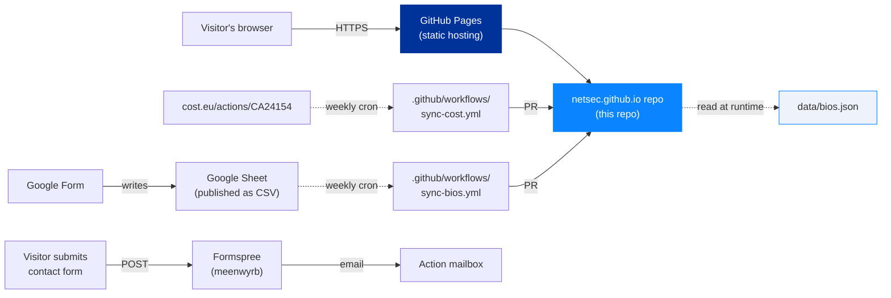
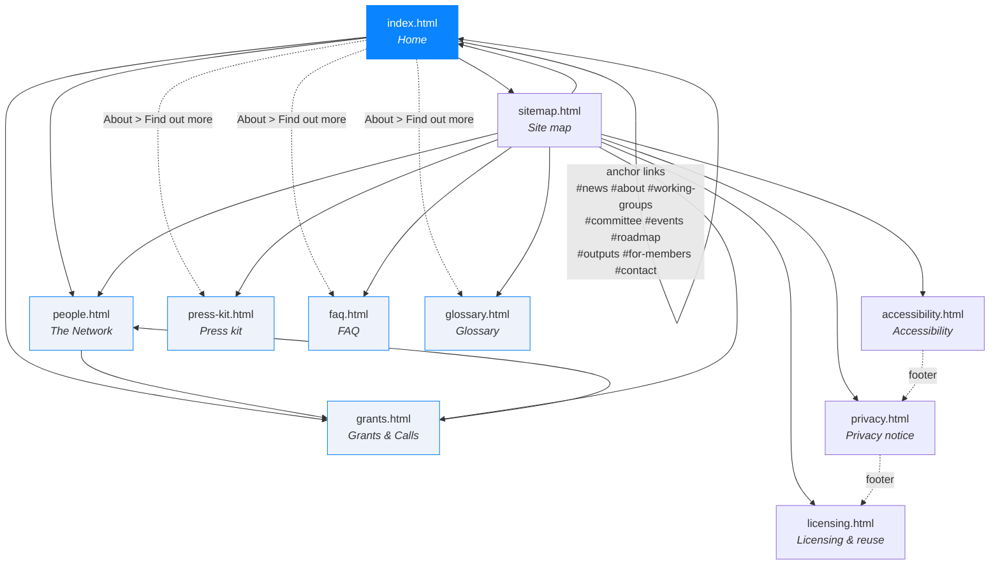
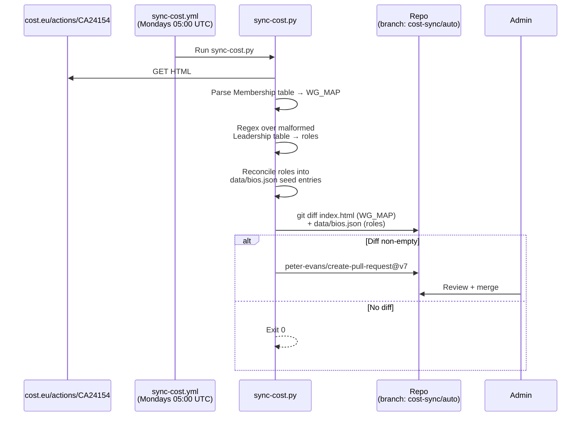
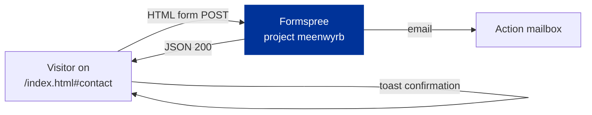

# Architecture

> *Audience: developers and maintainers who want to understand or
> extend the site.*

## Purpose

The NetSec website serves three distinct audiences with one
deliverable:

1. **The wider research community** — anyone working in or alongside
   European security studies. The site explains what the Action is,
   who's involved, what events are coming up, and how to engage.
2. **MC members, WG participants, and grant applicants** — practical
   resources: grant calls, e-COST workflow, deliverables, roadmap.
3. **External evaluators and funders** — COST and the EU Commission,
   for whom the site is also **Deliverable D1** (open community
   directory) of the Action's MoU.

Anything we add or change should help at least one of these groups
without confusing the others.

## Tech stack at a glance



- **No build step.** Every page is hand-authored HTML. The shared
  CSS and JS load directly from `assets/`.
- **No framework.** Vanilla browser APIs only.
- **No database.** Persistent state lives in `data/*.json`, committed
  to git.
- **No analytics or tracking.** Loading footprint is ~140 KB
  uncompressed including fonts.

## Site structure



| Page                  | Purpose                                                                         | Reads at runtime         |
| --------------------- | ------------------------------------------------------------------------------- | ------------------------ |
| `index.html`          | Action overview, news, WGs, MC composition, events, roadmap, outputs, *Find out more* discovery grid, *For NetSec members* Wiki signposting strip, contact | `data/bios.json` (none — leadership baked in via `data-bios-roles`) |
| `people.html`         | Open community directory with WG/MC/country filters and the Join-the-network CTA| `data/bios.json` (full) |
| `grants.html`         | The five NetSec grant schemes, the e-COST timeline, resources, grant managers   | `data/bios.json` (Grant Awarding Coordinator cards) |
| `faq.html`            | 21 Q&As across six themed sections, with a jump-to TOC and per-question deep-link anchors. Migrated from the members' Wiki in website v1.3.0. | nothing |
| `glossary.html`       | ~35 COST and NetSec terms across five sections, with per-term deep-link anchors. Migrated from the members' Wiki in website v1.3.0. | nothing |
| `press-kit.html`      | Logos with pairing rules, colour palette, typography reference, funding-acknowledgement boilerplate (full / short / one-line), CC BY 4.0 attribution wording, do / don't rules. Added in website v1.2.0. | nothing |
| `sitemap.html`        | User-friendly site map linking every page and every in-page anchor              | nothing |
| `accessibility.html`  | WCAG 2.1 conformance statement                                                  | nothing |
| `privacy.html`        | GDPR-compliant privacy notice                                                   | nothing |
| `licensing.html`      | Dual-licence posture (MIT for code, CC BY 4.0 for prose) with the carve-outs spelt out. Split off from `privacy.html` §10. | nothing |

## Feature inventory

### User-facing

- **Light/dark theme toggle** with `prefers-color-scheme` default,
  manual override in `localStorage` (`netsec-theme`).
- **Reveal-on-scroll** powered by `IntersectionObserver`. Falls back
  to "always visible" if JS is disabled or the observer fails.
- **Glass cards** with `backdrop-filter`; graceful fallback under
  `@supports not (backdrop-filter)`.
- **Country flags** thumbnails via FlagCDN for every ISO country
  code (~200), used in the MC-by-country grid and member cards.
- **Network directory filters** — free-text search × WG/MC chip ×
  country dropdown, all AND-combined client-side.
- **Two view densities on the directory** — detailed (photo + bio
  + contact icons) and compact (one-row, flag + affiliation + WG
  chips). Switched via a segmented toggle in the toolbar; preference
  persists in `localStorage('netsec-directory-view')`.
- **Click-to-expand in compact mode** — clicking a compact card
  flips it to its detailed form in place while the rest of the
  grid stays compact. URL hash `#slug` mirrors the expanded card
  for shareable deep-links; Esc / click-outside collapses. Tracked
  upgrade path to a sticky side panel in Issue #72.
- **First-visit orientation** — a dismissible welcome strip above
  the directory toolbar, plus a `?` button that re-opens an
  opt-in six-step guided tour (search → filter chips → country
  → density toggle → `+` quick-join → join card).
- **`+` quick-join button** in the directory toolbar — smooth-
  scrolls to the join card at the foot of the page and focuses
  the *Add your bio* CTA.
- **Bio collapse** — bios over 4 lines auto-detect and add a "Show
  more / Show less" toggle.
- **Awarding-process timeline** on `grants.html` — numbered nodes on
  a gradient rail with Before / During / After pills.
- **e-COST portal model** spelt out on `grants.html`: the portal is
  a single general COST surface that NetSec cannot customise. It
  filters visibility by applicant profile (ITC only to ITC
  affiliates, YRIG only to under-40s), so an applicant might not
  see every scheme listed. The portal can also surface grant types
  from other COST programmes that NetSec hasn't budgeted for;
  applications for anything outside the Work and Budget Plan are
  rejected by the Grant Awarding Coordinator. The Grants page sets
  expectations openly so members don't apply for what we can't
  fund.
- **Site-wide search** powered by [Pagefind](https://pagefind.app/).
  A modal overlay triggered by Cmd/Ctrl-K, `/` (anywhere outside
  an input), or the magnifying-glass button in the nav. Indexes
  every `<main data-pagefind-body>` across all 30 public pages
  (EN + FR + DE); results are scoped to the visitor's active
  locale automatically. Each `<h1>`/`<h2>`/`<h3>` becomes a
  sub-result with a deep-link anchor — searches against long
  pages like FAQ and Glossary jump straight to the matched
  section. Lazy-loaded on first overlay open. Queries never
  leave the visitor's browser; the index is served from
  `/pagefind/` on the same origin. Keyboard navigation, focus
  trap, `aria-live` result count, full light + dark theme
  parity.

### Operator-facing

- **Two weekly sync workflows** (see below) that open PRs rather
  than silently pushing to `main`.
- **`data-bios-roles` runtime binding** — any HTML element with this
  attribute gets populated from `data/bios.json` at load, so the
  grant-manager cards on `grants.html` and the Action-leadership
  blurbs on `index.html` stay in step with the directory without
  duplicating data.
- **MC member auto-tagging** — `sync-bios.py` cross-references new
  submissions against `data/mc-members.json` and appends an
  `MC member · <Country>` role if the name matches.
- **Brand-accurate social icons** — Simple Icons SVGs for ORCID
  (with the official green), LinkedIn, X, Bluesky, Mastodon.

## Data flow

### How a bio gets onto the site


### How a cost.eu change propagates



> **Why regex over the Leadership table?** cost.eu emits a malformed
> `</div>` where `</td>` should close — that breaks BeautifulSoup's
> table parser silently (only 5 of 14 roles come through). The
> regex falls back to the raw HTML and walks every `<td>…</td>`
> ending in a known leadership suffix (Chair, Coordinator, Leader,
> Co-Lead, Representative).

### How a contact-form submission flows



Formspree is the only third-party that ever sees visitor data
besides GitHub Pages' own access logs. The full processor list is in
[`privacy.html`](https://netsec-cost.eu/privacy.html).

### How the ESSC programme stays live

The annual conference page at `/essc-2026.html` (and FR / DE
variants) renders its programme grid from `data/indico.json`,
which is mirrored daily from the shared EISS Indico instance at
`indico.eiss-europa.com`. The full pipeline:

1. `scripts/sync-indico.py` runs at 03:45 UTC each day via
   `.github/workflows/sync-indico.yml`. It calls Indico's
   `/export/categ/1.json` and `/export/timetable/{event_id}.json`,
   normalises the response, and writes `data/indico.json`.
2. The script also patches `data/events.json` (entries with an
   `indicoEventId` field get `summary` / `start` / `end` overwritten
   from the same Indico payload, allow-list only) and regenerates
   `calendar.ics` so the home-page banner + the subscribable
   calendar feed stay in step with the live programme. See
   `docs/indico-sync.md` *Companion files* for the rationale.
3. When the data half of any output changed, the workflow opens (or
   updates) a pull request on `indico-sync/auto` via
   `peter-evans/create-pull-request`, labels it `automated`, and
   enables auto-merge with squash. CodeQL runs as a separate
   workflow on the bot PR, all four required checks complete, and
   auto-merge fires hands-free. Otherwise the working tree stays
   clean and the workflow is a no-op. (Direct push to `main` was the
   previous design; the v1.6.1 ruleset tightening made it
   incompatible. See the 2026-05-24 entry in the Wiki Decisions log.)
4. On every visit to `/essc-2026.html`, the inline JS at the foot
   of the page fetches `data/indico.json`, picks the right year
   under `annualConferences`, and renders the day chips, time
   blocks, parallel sessions, and contributions.

The design rationale lives at
[`docs/indico-sync.md`](indico-sync.md) and (canonically) in the
EISS repository's `docs/indico-programme-integration.md`.

## Repository layout

```
.
├── index.html                       # Home
├── people.html                      # The Network
├── grants.html                      # Grants & Calls
├── faq.html                         # Public FAQ (21 Q&As, six sections)
├── glossary.html                    # COST + NetSec terminology (~35 terms)
├── press-kit.html                   # Logos, palette, funding acknowledgements
├── accessibility.html               # WCAG statement
├── privacy.html                     # GDPR notice
├── licensing.html                   # Dual-licence posture
├── sitemap.html                     # User-friendly site map
├── 404.html                         # Not-found page (locale-detecting)
├── {page}.fr.html                   # French beta of every page above (except 404)
├── {page}.de.html                   # German beta of every page above (except 404)
│
├── sitemap.xml                      # Machine-readable sitemap with hreflang siblings
├── CNAME                            # GitHub Pages → netsec-cost.eu
│
├── assets/
│   ├── css/site.css                 # Single shared stylesheet
│   ├── js/site.js                   # Nav, theme, reveal-on-scroll, accordions, directory
│   ├── images/people/*.{jpg,png}    # Member headshots (downloaded by sync-bios)
│   ├── images/cost-logo.jpg         # COST logotype
│   ├── images/og-image.png          # Open Graph card (1200 × 630)
│   └── images/logo.png              # Favicon / NS mark
│
├── data/
│   ├── bios.json                    # The directory (members, roles, WGs, contacts)
│   ├── mc-members.json              # MC roster per country (used to auto-tag MC role)
│   ├── i18n-state.json              # SHA-1 stamps for translation-drift tracking
│   └── events.json                  # Source of truth for /calendar.ics (and Events cards)
│
├── pagefind/                        # Built at deploy time, not committed (gitignored)
│
├── scripts/
│   ├── sync-cost.py                 # Pulls WG_MAP + leadership from cost.eu
│   ├── sync-bios.py                 # Pulls Google Form submissions
│   ├── bios-source.json             # CSV URL + form URL + column mapping
│   ├── inject-seo.py                # Idempotent canonical/OG/JSON-LD generator
│   ├── check-i18n-drift.py          # Reports stale translations vs. EN source
│   ├── build-calendar.py            # Generates /calendar.ics from data/events.json
│   ├── build-search.sh              # Builds /pagefind/ via `npx pagefind` (gitignored)
│   ├── release.sh                   # Cuts a tagged release; promotes CHANGELOG
│   └── requirements.txt             # requests, beautifulsoup4, Pillow
│
├── .github/workflows/
│   ├── pages-deploy.yml             # Build → deploy on push-to-main (builds /pagefind/ here)
│   ├── sync-cost.yml                # Weekly cron — opens PR if WG_MAP / roles changed
│   ├── sync-bios.yml                # Weekly cron — opens PR if bios.json changed
│   ├── i18n-drift.yml               # Drift checker for FR/DE translations
│   ├── calendar-drift.yml           # Drift checker for /calendar.ics vs. events.json
│   ├── external-link-arrows.yml    # Lint: trailing → on external links
│   └── search-drift.yml             # Build sanity check on PRs (per-locale page count > 0)
│
├── docs/                            # ← you are here
│   ├── README.md                    # ToC for this folder
│   ├── architecture.md              # this file
│   ├── design-system.md
│   ├── admin-guide.md
│   ├── i18n.md                      # Translation workflow + drift conventions
│   ├── seo.md                       # SEO injector design, OG/JSON-LD schema
│   ├── bios-setup.md                # One-time Google Form set-up guide
│   ├── pdf/                         # Source for the documentation pack
│   │   ├── documentation.html       # Single-file source, rendered to PDF
│   │   ├── build.sh                 # Headless-Chrome → PDF builder
│   │   └── NetSec-website-documentation.pdf
│   └── promo/                       # Promotional poster (A3) and card-size variant
│
├── CHANGELOG.md                     # Keep a Changelog format, SemVer 2.0.0
├── LICENSE                          # MIT (code)
├── LICENSE-CONTENT                  # CC BY 4.0 (prose) with carve-outs
├── README.md                        # Project entry point
└── SECURITY.md                      # Coordinated-disclosure policy
```

## Naming and code conventions

- **British English** in all user-facing copy.
- **Slugs** are produced by `slugify()` in both Python sync scripts
  (must stay in lockstep): strip salutation prefix, drop diacritics,
  drop apostrophes, lowercase, replace anything not `[a-z0-9]` with
  `-`, collapse runs.
- **Member IDs** in `bios.json` are the slug of the cleaned name —
  stable across submissions, used as the DOM `id` on member cards
  so deep-links like `/people.html#arthur-laudrain` resolve.
- **Comments in CSS and JS** are full sentences explaining intent
  (why the code is there), not paraphrasing the code itself.
- **No JS framework, no transpiler, no bundler.** If a feature needs
  one, the bar is high — open an issue first.

## Extending the site

If you're adding a new page:

1. Copy a prose-page skeleton (e.g. `licensing.html` or `faq.html`) —
   either provides the canonical `<head>`, theme-FOUC script,
   ambience blobs, nav, and footer.
2. Decide whether the page belongs in the top nav (10 items already;
   keep tight). If not, signpost it via the home page's *Find out
   more* discovery grid at the end of the About section.
3. Create FR + DE beta siblings (`page.fr.html`, `page.de.html`).
   Translate chrome and content manually — no machine translation.
4. Add the page to `data/i18n-state.json` (the SHA-1 drift manifest)
   and run `python3 scripts/check-i18n-drift.py --mark-fresh page.html fr`
   (and `... de`) to stamp the translations.
5. Add the slug to the `PAGES` list in `scripts/inject-seo.py` and
   run it to inject canonical / OG / Twitter Card / JSON-LD blocks.
6. Add the page (with `<xhtml:link>` siblings for FR/DE) to
   `sitemap.xml`, and list it in `sitemap.html` (+ FR/DE) under the
   right branch.
7. Add a footer link on every other page (`grep` for an existing
   footer-link pattern and replicate it across the 24 page × locale
   permutations).
8. Mark the new page's searchable content with `data-pagefind-body`
   on the `<main>` element so the Pagefind indexer picks it up.
   You don't need to commit anything under `/pagefind/`: the index
   is built fresh on every deploy by `.github/workflows/pages-deploy.yml`
   and `/pagefind/` itself is gitignored. `search-drift.yml` runs on
   every PR that touches HTML and verifies the build succeeds with
   non-zero per-locale page counts — so a forgotten `data-pagefind-body`
   marker or a regression in `scripts/build-search.sh` is still caught.
   To preview a content change with working search locally, run
   `./scripts/build-search.sh` and serve the working tree
   (`python3 -m http.server`); the result is gitignored.
9. Bump the version stamp in the page meta-strip if you're adding
   a privacy- or accessibility-relevant page.

If you're adding a new field to `bios.json`:

1. Add the question to the Google Form.
2. Add the column to `scripts/bios-source.json` → `columns`.
3. Add the field to `_make_seed_entry()` and to the form-row parser
   in `scripts/sync-bios.py`.
4. Render it where it should appear (`people.html`,
   `index.html` if leadership, `grants.html` if grant manager).
5. Update `docs/bios-setup.md` so the next admin doesn't have to
   reverse-engineer the change.

If you're adding a new event to the Events section:

1. **Add the structured form to `data/events.json`.** This is the
   single source of truth for the public `/calendar.ics` feed.
   - `uid`: stable identifier of the form `<slug>@netsec-cost.eu`
     so subscribers don't get duplicate events on later edits.
   - `start` / `end`: ISO-8601 local time in the format
     `YYYY-MM-DDTHH:MM` (no timezone suffix — the file-level
     `tzid` attaches the zone).
   - Update the top-level `dtstamp` field to today (any edit
     counts as a republication of the feed under RFC 5545).
   - Escape sequences are handled by the generator — write commas
     and apostrophes naturally in the JSON.
2. **Regenerate `calendar.ics`**: `python3 scripts/build-calendar.py`.
   CI (`.github/workflows/calendar-drift.yml`) runs the same script
   with `--check` on every PR and fails if `calendar.ics` would
   change — so you can't merge an `events.json` edit without
   regenerating.
3. **Add the matching `<article class="event-card">`** to
   `index.html` plus the FR and DE siblings — same dates,
   translated copy. The HTML cards stay hand-authored because they
   carry locale-specific framing that doesn't trivially derive
   from JSON. Re-stamp i18n drift if the EN markup changed.
4. TBA / undated events are deliberately **not** added to
   `data/events.json` until they have firm dates — calendar
   subscribers should not see placeholders. The TBA HTML card on
   `index.html` is fine to leave as a teaser.
5. If a new event sits outside `Europe/Stockholm`, add the
   corresponding `VTIMEZONE` block to `render_vtimezone()` in
   `scripts/build-calendar.py` (the script refuses to run without
   one).
