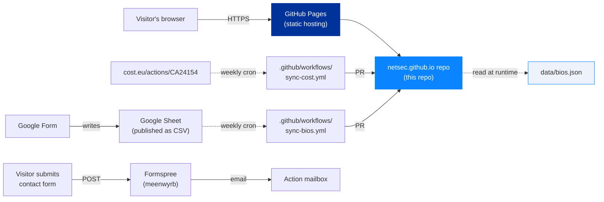
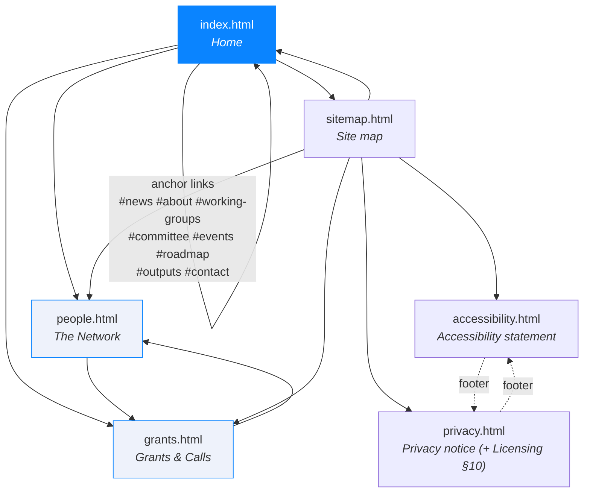
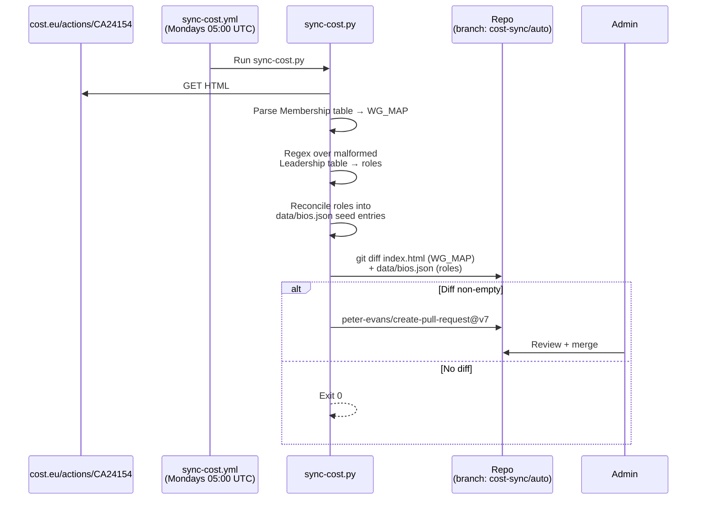
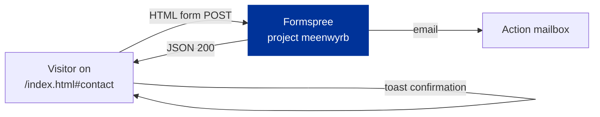

# Architecture

> *Audience: developers and maintainers who want to understand or
> extend the site.*

## Purpose

The NetSec website serves three distinct audiences with one
deliverable:

1. **The wider research community** — anyone working in or alongside
   European security studies. The site explains what the Action is,
   who's involved, what events are coming up, and how to engage.
2. **MC members, WG participants, and grant applicants** — practical
   resources: grant calls, e-COST workflow, deliverables, roadmap.
3. **External evaluators and funders** — COST and the EU Commission,
   for whom the site is also **Deliverable D1** (open community
   directory) of the Action's MoU.

Anything we add or change should help at least one of these groups
without confusing the others.

## Tech stack at a glance



- **No build step.** Every page is hand-authored HTML. The shared
  CSS and JS load directly from `assets/`.
- **No framework.** Vanilla browser APIs only.
- **No database.** Persistent state lives in `data/*.json`, committed
  to git.
- **No analytics or tracking.** Loading footprint is ~140 KB
  uncompressed including fonts.

## Site structure



| Page                  | Purpose                                                                         | Reads at runtime         |
| --------------------- | ------------------------------------------------------------------------------- | ------------------------ |
| `index.html`          | Action overview, news, WGs, MC composition, events, roadmap, outputs, contact   | `data/bios.json` (none — leadership baked in via `data-bios-roles`) |
| `people.html`         | Open community directory with WG/MC/country filters and the Join-the-network CTA| `data/bios.json` (full) |
| `grants.html`         | The five NetSec grant schemes, the e-COST timeline, resources, grant managers   | `data/bios.json` (Grant Awarding Coordinator cards) |
| `sitemap.html`        | User-friendly site map linking every page and every in-page anchor              | nothing |
| `accessibility.html`  | WCAG 2.1 conformance statement                                                  | nothing |
| `privacy.html`        | GDPR-compliant privacy notice; §10 covers reuse/licensing                       | nothing |

## Feature inventory

### User-facing

- **Light/dark theme toggle** with `prefers-color-scheme` default,
  manual override in `localStorage` (`netsec-theme`).
- **Reveal-on-scroll** powered by `IntersectionObserver`. Falls back
  to "always visible" if JS is disabled or the observer fails.
- **Glass cards** with `backdrop-filter`; graceful fallback under
  `@supports not (backdrop-filter)`.
- **Country flags** thumbnails via FlagCDN for every ISO country
  code (~200), used in the MC-by-country grid and member cards.
- **Network directory filters** — free-text search × WG/MC chip ×
  country dropdown, all AND-combined client-side.
- **Two view densities on the directory** — detailed (photo + bio
  + contact icons) and compact (one-row, flag + affiliation + WG
  chips). Switched via a segmented toggle in the toolbar; preference
  persists in `localStorage('netsec-directory-view')`.
- **Click-to-expand in compact mode** — clicking a compact card
  flips it to its detailed form in place while the rest of the
  grid stays compact. URL hash `#slug` mirrors the expanded card
  for shareable deep-links; Esc / click-outside collapses. Tracked
  upgrade path to a sticky side panel in Issue #72.
- **First-visit orientation** — a dismissible welcome strip above
  the directory toolbar, plus a `?` button that re-opens an
  opt-in six-step guided tour (search → filter chips → country
  → density toggle → `+` quick-join → join card).
- **`+` quick-join button** in the directory toolbar — smooth-
  scrolls to the join card at the foot of the page and focuses
  the *Add your bio* CTA.
- **Bio collapse** — bios over 4 lines auto-detect and add a "Show
  more / Show less" toggle.
- **Awarding-process timeline** on `grants.html` — numbered nodes on
  a gradient rail with Before / During / After pills.
- **e-COST portal model** spelt out on `grants.html`: the portal is
  a single general COST surface that NetSec cannot customise. It
  filters visibility by applicant profile (ITC only to ITC
  affiliates, YRIG only to under-40s), so an applicant might not
  see every scheme listed. The portal can also surface grant types
  from other COST programmes that NetSec hasn't budgeted for;
  applications for anything outside the Work and Budget Plan are
  rejected by the Grant Awarding Coordinator. The Grants page sets
  expectations openly so members don't apply for what we can't
  fund.

### Operator-facing

- **Two weekly sync workflows** (see below) that open PRs rather
  than silently pushing to `main`.
- **`data-bios-roles` runtime binding** — any HTML element with this
  attribute gets populated from `data/bios.json` at load, so the
  grant-manager cards on `grants.html` and the Action-leadership
  blurbs on `index.html` stay in step with the directory without
  duplicating data.
- **MC member auto-tagging** — `sync-bios.py` cross-references new
  submissions against `data/mc-members.json` and appends an
  `MC member · <Country>` role if the name matches.
- **Brand-accurate social icons** — Simple Icons SVGs for ORCID
  (with the official green), LinkedIn, X, Bluesky, Mastodon.

## Data flow

### How a bio gets onto the site


### How a cost.eu change propagates



> **Why regex over the Leadership table?** cost.eu emits a malformed
> `</div>` where `</td>` should close — that breaks BeautifulSoup's
> table parser silently (only 5 of 14 roles come through). The
> regex falls back to the raw HTML and walks every `<td>…</td>`
> ending in a known leadership suffix (Chair, Coordinator, Leader,
> Co-Lead, Representative).

### How a contact-form submission flows



Formspree is the only third-party that ever sees visitor data
besides GitHub Pages' own access logs. The full processor list is in
[`privacy.html`](https://netsec-cost.eu/privacy.html).

## Repository layout

```
.
├── index.html                       # Home
├── people.html                      # The Network
├── grants.html                      # Grants & Calls
├── accessibility.html               # WCAG statement
├── privacy.html                     # GDPR notice
├── sitemap.html                     # User-friendly site map
│
├── assets/
│   ├── css/site.css                 # Single shared stylesheet
│   ├── js/site.js                   # Nav, theme, reveal-on-scroll, accordions
│   ├── images/people/*.{jpg,png}    # Member headshots (downloaded by sync-bios)
│   ├── images/cost-logo.jpg         # COST logotype
│   └── images/logo.png              # Favicon / NS mark
│
├── data/
│   ├── bios.json                    # The directory (members, roles, WGs, contacts)
│   └── mc-members.json              # MC roster per country (used to auto-tag MC role)
│
├── scripts/
│   ├── sync-cost.py                 # Pulls WG_MAP + leadership from cost.eu
│   ├── sync-bios.py                 # Pulls Google Form submissions
│   ├── bios-source.json             # CSV URL + form URL + column mapping
│   └── requirements.txt             # requests, beautifulsoup4, Pillow
│
├── .github/workflows/
│   ├── sync-cost.yml                # Weekly cron — opens PR if WG_MAP / roles changed
│   └── sync-bios.yml                # Weekly cron — opens PR if bios.json changed
│
├── docs/                            # ← you are here
│   ├── README.md                    # ToC for this folder
│   ├── architecture.md              # this file
│   ├── design-system.md
│   ├── admin-guide.md
│   └── bios-setup.md                # One-time Google Form set-up guide
│
├── LICENSE                          # MIT (code)
├── LICENSE-CONTENT                  # CC BY 4.0 (prose) with carve-outs
├── README.md                        # Project entry point
├── SECURITY.md                      # Coordinated-disclosure policy
└── CNAME                            # GitHub Pages → netsec-cost.eu
```

## Naming and code conventions

- **British English** in all user-facing copy.
- **Slugs** are produced by `slugify()` in both Python sync scripts
  (must stay in lockstep): strip salutation prefix, drop diacritics,
  drop apostrophes, lowercase, replace anything not `[a-z0-9]` with
  `-`, collapse runs.
- **Member IDs** in `bios.json` are the slug of the cleaned name —
  stable across submissions, used as the DOM `id` on member cards
  so deep-links like `/people.html#arthur-laudrain` resolve.
- **Comments in CSS and JS** are full sentences explaining intent
  (why the code is there), not paraphrasing the code itself.
- **No JS framework, no transpiler, no bundler.** If a feature needs
  one, the bar is high — open an issue first.

## Extending the site

If you're adding a new page:

1. Copy `accessibility.html` as a skeleton — it has the canonical
   `<head>`, theme-FOUC script, ambience blobs, nav, and footer.
2. Update the nav `<a aria-current="page">` on the new page so the
   header shows the active link.
3. Add the page to `sitemap.html` and to every other page's footer
   list of statutory links if it's a statutory page.
4. Bump the version stamp in the page meta-strip if you're adding
   a privacy- or accessibility-relevant page.

If you're adding a new field to `bios.json`:

1. Add the question to the Google Form.
2. Add the column to `scripts/bios-source.json` → `columns`.
3. Add the field to `_make_seed_entry()` and to the form-row parser
   in `scripts/sync-bios.py`.
4. Render it where it should appear (`people.html`,
   `index.html` if leadership, `grants.html` if grant manager).
5. Update `docs/bios-setup.md` so the next admin doesn't have to
   reverse-engineer the change.
