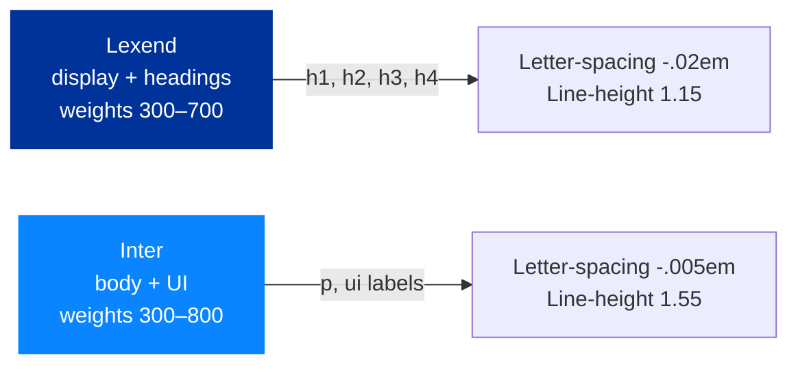

# Design system

> *Audience: anyone changing the visual or interaction layer of the
> site.*

The NetSec site follows an **Apple-inspired glassmorphism** language
on top of EU/COST brand colours. The look should feel modern,
trustworthy, and Brussels-adjacent without being corporate.

## Principles

1. **Restraint over decoration.** White space, generous line-height,
   and one strong colour beat busy gradients and animated icons.
2. **Glass cards as the unit of UI.** Almost every distinct piece of
   information is wrapped in a `.glass` card. They define hierarchy.
3. **Stroke icons for generic glyphs, brand icons for brands.**
   Lucide-style strokes for envelope/globe/etc; Simple Icons for
   ORCID, LinkedIn, X, Bluesky, Mastodon.
4. **Motion is a hint, not a feature.** Hover transforms ≤ 4 px,
   transitions ≤ 300 ms, no parallax or scroll-jacking.
5. **British English** copy throughout.
6. **Accessibility first.** Every interactive element is keyboard
   reachable, every colour pair meets WCAG 2.1 AA, every page
   passes the skip-link → main flow.

## Colour tokens

Defined in `assets/css/site.css` as CSS custom properties on `:root`
and `:root.dark`. **Always reference the token**, never the raw hex.

| Token                 | Light value             | Used for                                                       |
| --------------------- | ----------------------- | -------------------------------------------------------------- |
| `--bg-0`              | `#f6f8fc`               | Page background                                                |
| `--bg-1`              | `#eef2fb`               | Slight elevation backdrop (used inside the ambience blobs)     |
| `--ink`               | `#0b1220`               | Headings, primary copy                                         |
| `--ink-2`             | `#2b3850`               | Body copy, sub-headings                                        |
| `--muted`             | `#5a6679`               | Captions, meta text, fineprint                                 |
| `--line`              | `rgba(11,18,32,.08)`    | Dividers, card borders in low-emphasis contexts                |
| `--glass-bg`          | `rgba(255,255,255,.55)` | Default glass card fill                                        |
| `--glass-bg-strong`   | `rgba(255,255,255,.72)` | Sticky nav, more opaque cards                                  |
| `--glass-border`      | `rgba(255,255,255,.6)`  | Glass card border                                              |
| `--glass-shadow`      | `0 10px 40px rgba(20,35,80,.10), 0 1px 2px rgba(20,35,80,.06)` | Glass card shadow             |
| `--accent`            | **`#003399`** (EU blue) | Primary brand colour — buttons, focus rings, accents           |
| `--accent-2`          | **`#0a84ff`** (Apple blue) | Hyperlinks, secondary accent                                 |
| `--accent-glow`       | `rgba(10,132,255,.35)`  | Soft glow under hovered primary buttons                        |
| `--ease`              | `cubic-bezier(.22,.61,.36,1)` | Default transition curve — Apple-ish overshoot          |

The dark theme inverts `--bg-*`, `--ink*`, `--line`, and `--glass-*`
but keeps `--accent` / `--accent-2` identical so brand colour is
constant across modes.

## Typography



- **Lexend** for headlines — high x-height, friendly, optimised for
  reading speed.
- **Inter** for body and UI — battle-tested at small sizes, full
  weight range.

Both are loaded once from Google Fonts via a `<link rel="preconnect">`
+ stylesheet pair in every page's `<head>`.

Heading hierarchy across the site is currently:

| Level | Count | Example                                |
| ----- | ----- | -------------------------------------- |
| `h1`  | 1 per page | "The Network", "Grants & Calls"   |
| `h2`  | 6–9   | Major sections                         |
| `h3`  | ~20   | Sub-sections, member names             |
| `h4`  | ~18   | Card titles, country names             |

Never skip a level (no `h2` → `h4`).

## Components

The site is built from a small kit of components. They live in
`assets/css/site.css`; each has a leading comment block explaining
intent. Use the existing classes — don't introduce parallel ones.

### `.glass` — the workhorse card

```html
<article class="glass" style="padding:24px">…</article>
```

Backdrop-filter blur, semi-transparent fill, soft shadow, slight
lift on hover. Used by news cards, member cards, country cards,
grant cards, MC cards, resource cards, the timeline cards, the
join-the-network CTA, the contact form, the search toolbar.

### `.btn`, `.btn-primary`, `.btn-ghost`

```html
<a class="btn btn-primary" href="…">Discover the Action</a>
<a class="btn btn-ghost"    href="…">Join the network</a>
```

Primary = filled `--ink`, hover → `--accent` + glow. Ghost =
transparent with a border, hover → slight lift + glass fill.

### `.chip`, `.wg-chip`, `.grant-tag`

Small pill-shaped labels:

- `.chip` — neutral keyword pill in the hero
- `.wg-chip wg-1` … `wg-4` — colour-coded Working Group chips on
  member cards
- `.grant-tag` — uppercase tag inside a grant card head

### `.eyebrow`

```html
<span class="eyebrow">Directory</span>
<h1>The Network</h1>
```

Small uppercase letter-spaced label above an `h1` or `h2`. Conveys
section context without competing for hierarchy.

### `.timeline` (grants page)

Vertical timeline with `counter-reset:step` numbering and a
gradient rail. Each `.timeline-item` becomes the next numbered
node automatically.

### `.mc-stats`

Three-up snapshot grid used on the home page (49 MC reps,
30 countries, ~51 % women). One-column on phones.

### `.country-grid` / `.country-card`

Responsive card grid showing the 30 MC countries with FlagCDN flags.

### `.members-toolbar`, `.members-filter-chip`, `.members-country`

Toolbar at the top of `people.html`. Free-text search + WG/MC chips
+ country `<select>`. All ANDed by the directory's render loop.

## Animations

- `.reveal` — fades in + slides up 12 px when intersecting viewport.
  Default state is **visible**; the `js-reveal` class on `<html>`
  (added by `site.js`) opts in to the fade-out-then-in. If JS
  fails, content stays visible.
- `.blob` — three large translucent radial blobs in `.ambience`,
  drifting on a 22–34 s loop with `transform: translate + scale`.
  Pure decoration; `aria-hidden="true"`.
- Glass-card hovers — 250 ms `translateY(-4px)` + shadow swap.
- Theme toggle — instant; no transition (the FOUC-prevention script
  runs before paint).

## Iconography

Two SVG styles coexist by design:

| Style    | When to use                                                   | Source / template                                                                |
| -------- | ------------------------------------------------------------- | -------------------------------------------------------------------------------- |
| Stroke   | Generic glyphs (envelope, globe, briefcase, microphone, etc.) | Lucide-style: `stroke="currentColor"`, `stroke-width="1.9"`, `fill="none"`       |
| Filled brand | Recognisable brand marks (ORCID, LinkedIn, X, Bluesky, Mastodon) | Simple Icons: `fill="currentColor"` (or brand colour via a dedicated class) |

**ORCID specifically** is rendered in brand green via `.contact-orcid`
because monochrome makes it look like a generic icon. Other brand
marks inherit `currentColor` so they pick up theme.

Same-concept-same-icon rule: every conference grant uses the same
microphone icon; every contact-item uses the same envelope.

## Responsive breakpoints

| Breakpoint        | What changes                                                                  |
| ----------------- | ----------------------------------------------------------------------------- |
| < 880 px          | Mobile nav (menu-toggle), single-column hero, smaller paddings                |
| < 600 px          | MC stats stack to one column, timeline node sizes shrink, country grid compacts |

There is **no fixed mobile breakpoint** — most layouts use
`auto-fill` / `minmax()` grids so they re-flow continuously rather
than at hard breakpoints.

## Accessibility checklist for new work

- [ ] All interactive controls reachable with keyboard alone
- [ ] Visible focus ring (use the existing `:focus-visible` style)
- [ ] `aria-label` on icon-only buttons; `title` for hover hint
- [ ] Heading levels follow the hierarchy table above
- [ ] Colour contrast meets WCAG 2.1 AA in **both** themes (check
      against `--ink`, `--ink-2`, `--muted`)
- [ ] No content hidden behind `:hover` alone
- [ ] Animations respect `prefers-reduced-motion` (see existing
      `.reveal` fallback for the pattern)
- [ ] Skip-link still focuses `#top` (home) or `#main` (other pages)
      after your change

See [`accessibility.html`](https://netsec-cost.eu/accessibility.html)
for the live conformance statement.
