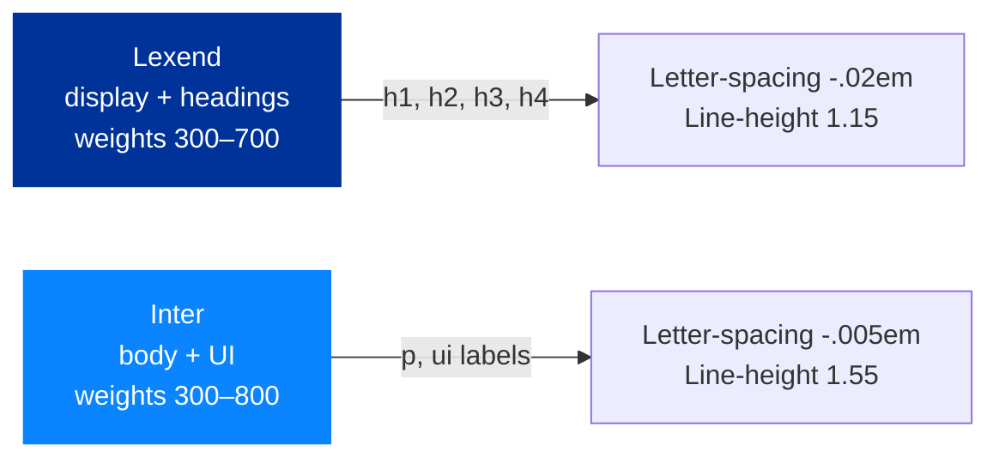

# Design system

> *Audience: anyone changing the visual or interaction layer of the
> site.*

The NetSec site follows an **Apple-inspired glassmorphism** language
on top of EU/COST brand colours. The look should feel modern,
trustworthy, and Brussels-adjacent without being corporate.

A rendered A4 companion to this document lives at
[`pdf/NetSec-Design-System.pdf`](./pdf/NetSec-Design-System.pdf): the
same language shown as colour swatches, type specimens and component
demos. It is built from the standalone design-system package, so it also
carries a tidied token layer (a full spacing scale, the extra radii, the
motion and shadow tokens) that this markdown and the live `site.css` do
not yet fully implement.

## Principles

1. **Restraint over decoration.** White space, generous line-height,
   and one strong colour beat busy gradients and animated icons.
2. **Glass cards as the unit of UI.** Almost every distinct piece of
   information is wrapped in a `.glass` card. They define hierarchy.
3. **Stroke icons for generic glyphs, brand icons for brands.**
   Lucide-style strokes for envelope/globe/etc; Simple Icons for
   ORCID, LinkedIn, X, Bluesky, Mastodon.
4. **Motion is a hint, not a feature.** Hover transforms ≤ 4 px,
   transitions ≤ 300 ms, no parallax or scroll-jacking.
5. **British English** copy throughout.
6. **Accessibility first.** Every interactive element is keyboard
   reachable, every colour pair meets WCAG 2.1 AA, every page
   passes the skip-link → main flow.

## Colour tokens

Defined in `assets/css/site.css` as CSS custom properties on `:root`
and `:root.dark`. **Always reference the token**, never the raw hex.

| Token                 | Light value             | Used for                                                       |
| --------------------- | ----------------------- | -------------------------------------------------------------- |
| `--bg-0`              | `#f6f8fc`               | Page background                                                |
| `--bg-1`              | `#eef2fb`               | Slight elevation backdrop (used inside the ambience blobs)     |
| `--ink`               | `#0b1220`               | Headings, primary copy                                         |
| `--ink-2`             | `#2b3850`               | Body copy, sub-headings                                        |
| `--muted`             | `#5a6679`               | Captions, meta text, fineprint                                 |
| `--line`              | `rgba(11,18,32,.08)`    | Dividers, card borders in low-emphasis contexts                |
| `--glass-bg`          | `rgba(255,255,255,.55)` | Default glass card fill                                        |
| `--glass-bg-strong`   | `rgba(255,255,255,.72)` | Sticky nav, more opaque cards                                  |
| `--glass-border`      | `rgba(255,255,255,.6)`  | Glass card border                                              |
| `--glass-shadow`      | `0 10px 40px rgba(20,35,80,.10), 0 1px 2px rgba(20,35,80,.06)` | Glass card shadow             |
| `--accent`            | **`#003399`** (EU blue) | Primary brand colour — buttons, focus rings, accents           |
| `--accent-2`          | **`#0a84ff`** (Apple blue) | Hyperlinks, secondary accent                                 |
| `--accent-glow`       | `rgba(10,132,255,.35)`  | Soft glow under hovered primary buttons                        |
| `--ease`              | `cubic-bezier(.22,.61,.36,1)` | Default transition curve — Apple-ish overshoot          |

The dark theme inverts `--bg-*`, `--ink*`, `--line`, and `--glass-*`
but keeps `--accent` / `--accent-2` identical so brand colour is
constant across modes.

### Type, spacing and imagery tokens

The editorial token layer (v1.13.0), also on `:root`. New work
references these steps rather than fresh ad-hoc values.

| Token group | Tokens                                              | Used for                                                                                   |
| ----------- | --------------------------------------------------- | ------------------------------------------------------------------------------------------ |
| Type scale  | `--fs-display`, `--fs-h1` … `--fs-h4`, `--fs-lede`  | Fluid `clamp()` sizes. `h1`–`h4` read them; `--fs-display` is the home hero lockup only.   |
| Spacing     | `--sp-1` (.25rem) … `--sp-8` (5rem), `--section-pad` | Vertical rhythm. `section` padding is `--section-pad`.                                     |
| Measure     | `--measure` (70ch), `--measure-narrow` (62ch)        | Prose column widths: ledes, section-head paragraphs, card prose.                           |
| Photo grade | `--photo-grade` (dark variant on `.dark`)            | One shared grade for content photography. Identity headshots keep natural colour by design. |
| Durations   | `--dur-fast` (.15s), `--dur` (.25s), `--dur-slow` (.35s) | The three motion speeds: micro feedback, hover states, surface moves. Reveal timings stay bespoke. |

## Typography



- **Lexend** for headlines — high x-height, friendly, optimised for
  reading speed.
- **Inter** for body and UI — battle-tested at small sizes, full
  weight range.
- Heading sizes come from the `--fs-*` tokens (fluid clamps), so
  don't hand-set new heading sizes in components.
- Headlines are solid `--ink`. The gradient text fills used before
  v1.13.0 cost contrast without adding presence and are retired;
  don't reintroduce them (the 404 numeral is the one deliberate
  exception).

Both are self-hosted as `assets/fonts/*.woff2` and preloaded in every
page's `<head>` (since v1.4.x, issue #121). There is no external Google
Fonts request.

Heading hierarchy across the site is currently:

| Level | Count | Example                                |
| ----- | ----- | -------------------------------------- |
| `h1`  | 1 per page | "The Directory", "Grants & Calls"   |
| `h2`  | 6–9   | Major sections                         |
| `h3`  | ~20   | Sub-sections, member names             |
| `h4`  | ~18   | Card titles, country names             |

Never skip a level (no `h2` → `h4`).

## Target size

**Every control in `<main>` that a person taps to do something clears 44 px
under a coarse pointer.** Buttons, disclosure summaries, inputs, and links
styled as buttons. That is WCAG 2.5.5 *Target Size (Enhanced)*.

The site is held to the 24 px minimum in 2.5.8 and clears it everywhere. The
higher bar is adopted here because the alternative was worse than either rule:
three controls sat at exactly 44 px and eight sat under it, so a person adding
a button had nothing to follow and an auditor had nothing to be told (#1689).

Three things are exempt, because they are not targets:

- **Labels and pills that describe rather than act.** A WG pill on an event
  card, a mentorship badge, a country flag.
- **Inline links in prose**, which WCAG 2.5.8 exempts explicitly.
- **Links whose hit area is a stretched overlay**, `.card-stretch` and its
  kin, where the thing a finger lands on is the whole card and the measured
  box is only the text.

The exemptions are not a list in prose. They are `NOT_A_TARGET` in
`scripts/measure.mjs`, so the rule can be run:

```bash
node scripts/measure.mjs targets people.html events.html --width 375x812 --fail
```

`--fail` exits non-zero on anything under the floor, and also on a run where
the coarse pointer was not emulated, since that run proves nothing.

`.github/workflows/target-size.yml` runs exactly that on every pull request
touching CSS, JS or a page, over the eight pages that actually carry controls.
It is not a required check yet: it is new and it drives a browser, and a gate
nobody trusts is worse than no gate. Promote it once it has been quiet for a
few weeks.

**Reach for padding, not `min-height`.** A control should grow around its text
rather than centre a short label in a tall box, and the coarse-pointer blocks
at the foot of each stylesheet do exactly that.

## Components

The site is built from a small kit of components. Core components live
in `assets/css/site.css`, loaded by every page; each has a leading
comment block explaining intent. Two page bundles carry page-specific
weight out of the shared render-blocking path (#1355):
`assets/css/directory.css` (the members directory and profile pages)
and `assets/css/roadmap.css` (the public roadmap). A rule belongs in a
bundle only when everything it can match lives on that bundle's pages;
anything a shared script can inject elsewhere (the tour engine chrome,
the `.members-filter-chip` pill the home events renderer borrows)
stays in core. The collision lint checks each file and flags a class
keyed in more than one stylesheet. Use the existing classes — don't
introduce parallel ones.

### `.glass` — the workhorse card

```html
<article class="glass" style="padding:24px">…</article>
```

Backdrop-filter blur, semi-transparent fill, soft shadow, slight
lift on hover. Used by news cards, member cards, country cards,
grant cards, MC cards, resource cards, the timeline cards, the
join-the-network CTA, the contact form, the search toolbar.

### `.card-clickable` / `.card-stretch` — whole-card click target

```html
<article class="news-card glass card-clickable">
  <h3>…</h3>
  <p>…</p>
  <a class="card-stretch" href="grants.html">View grants &amp; apply →</a>
</article>
```

Stretched-link pattern: add `.card-clickable` to a card and
`.card-stretch` to its single primary link. The link's `::before`
overlays the whole card (`position:absolute;inset:0`) so a click
anywhere on the card follows that one link, while the accessibility
tree still exposes one concise link (the CTA text), not the card's
whole body. Reach for this instead of wrapping the card in an `<a>`
whenever the card carries more than a line or two of text, since a
whole-card anchor would announce the entire paragraph as the link
name.

Notes and constraints:
- The overlay uses `::before`, not `::after`: the global external-link
  arrow marker already owns `::after` on `target="_blank"` links.
- Any other interactive element in the card (a second link, a button)
  must stay clickable; the utility lifts `.card-clickable a:not(.card-stretch)`
  and `button` above the overlay with `z-index:2`. A card with a
  nested in-body link is fine; a card whose only link sits inside body
  prose is not a good fit (no clear single CTA).
- Apply only to cards with one navigation destination. Do **not** apply
  to cards that are already interactive (directory `.member-card`
  expand, ESSC popover cards) or that have no destination — those get
  no hover affordance, so a hover lift only ever appears where a click
  leads somewhere. Also skip it on large cards that already carry a
  single prominent CTA button (the `/grants.html` grant cards): a
  whole-card target adds little there and is easy to mis-click.
- Tradeoff: the overlay sits above the card text, so click-drag text
  selection of the card body is impeded (same as any stretched-link or
  whole-anchor card). Acceptable for promo-style cards.
- In use on: the homepage event and news cards (all three locales).

### `.btn`, `.btn-primary`, `.btn-ghost`

```html
<a class="btn btn-primary" href="…">Discover the Action</a>
<a class="btn btn-ghost"    href="…">Join the network</a>
```

Primary = filled `--ink`, hover → `--accent` + glow. Ghost =
transparent with a border, hover → slight lift + glass fill.

### `.chip`, `.wg-chip`, `.grant-tag`

Small pill-shaped labels:

- `.chip` — quiet middot-separated keyword line in the hero (a pill
  until v1.13.0)
- `.wg-chip wg-1` … `wg-4` — colour-coded Working Group chips on
  member cards
- `.grant-tag` — uppercase tag inside a grant card head

### `.eyebrow`

```html
<span class="eyebrow">Directory</span>
<h1>The Directory</h1>
```

Small uppercase letter-spaced label above an `h1` or `h2`. Conveys
section context without competing for hierarchy. Since v1.13.0 it is
a bare editorial kicker in the accent colour, not a tinted pill.

### `.timeline` (grants page)

Vertical timeline with `counter-reset:step` numbering and a
gradient rail. Each `.timeline-item` becomes the next numbered
node automatically.

### `.mc-stats`

Three-up snapshot grid on the About page (MC representatives,
countries represented, ~51 % women). One-column on phones. The first
two numbers carry `data-cost-stat="mc-count"` / `"country-count"` and
are rewritten by `sync-cost.py` from the cost.eu roster, so don't
hand-edit them; only the approximate gender figure is manual.

### `.country-grid` / `.country-card`

Responsive card grid showing the MC countries with FlagCDN flags. The
grid markup is hand-authored (curated flags + deep-link ids) and
drift-checked against the synced roster, so it is not auto-generated.

Every flag on the site shares one sizing recipe: a fixed box (3:2, so
`28×19` on the country cards and `18×12` elsewhere) plus
`object-fit:contain`. FlagCDN serves each flag at its true proportions,
which run from square (Switzerland) to twice as wide as tall (the UK and
seven others), so sizing by width alone let the rendered height vary by a
factor of two and threw the card rows out of line. The fixed box keeps
each flag's own proportions without cropping, and reserves the space before
a lazy-loaded image arrives. The one deliberate exception is the
Directory's country filter strip (`.country-flag img`), which uses
`object-fit:cover` so its tiles read as a uniform row. That exception is
commented as such in `directory.css` to stop a well-meant "fix". The recipe is
documented once at `.country-card .flag` in `site.css` and cross-referenced
from `.search-bio-flag`, `.essc-member-card-country img`, and `.member-flag`.

### Deliverables Gantt (`.gantt` / `.g-row` / `.milestone`)

The About-page deliverables chart. One CSS grid owns the 17 column
tracks (label + 16 quarters) and every `.g-row` inherits them via
`grid-template-columns:subgrid`, so milestone markers line up across
rows at any zoom (an `@supports` fallback keeps per-row grids on
browsers without subgrid). Milestone pills read as `.milestone`
(planned), `.is-shipped` (delivered — the class name is retained
though the visible label is "Delivered"), `.is-early` (delivered
ahead of plan, the only green), and `.is-ghost` (the original planned
month when a deliverable shipped early). The roadmap's "show earlier
releases" collapse is a separate component driven by
`assets/js/roadmap-shipped-toggle.js`.

### `.members-toolbar`, `.members-filter-chip`, `.members-country`

Toolbar at the top of `people.html`. Free-text search + WG/MC chips
+ country `<select>`. All ANDed by the directory's render loop.

The toolbar also carries the **view-mode toggle** (`.view-toggle`),
the **`?` tour-trigger** (`#tour-trigger`), and the **`+`
join-trigger** (`#join-trigger`). The view-toggle switches the
grid between detailed (`.members-grid` default) and compact
(`.members-grid.is-compact`), persisted in
`localStorage('netsec-directory-view')`. The `?` opens the 6-step
guided tour. The `+` smooth-scrolls to `#join` and focuses the
*Add your bio* CTA — visually distinguished as an accent CTA
(`.tour-trigger-cta`) rather than the muted help affordance.

### `.member-preview-panel` (member preview, #72)

In compact mode, clicking a card opens that member's detail in a
preview panel instead of expanding it in the grid: a sticky right
rail (`position: fixed`, ~400px) on desktop, a bottom sheet over a
scrim on mobile (`max-width: 899px`). The grid never reflows. The
panel content is a runtime clone of the clicked card's own detail
body (the bio is forced open, the dead Show-more toggle dropped), so
there is no second renderer; the cloned `.member-card` gets
`.is-panel` to strip the grid-card chrome. `role="dialog"` with a
focus trap; focus returns to the card on close; Esc, the close
button, a click outside (desktop) or the scrim (mobile) all dismiss.
`prefers-reduced-motion` drops the slide. Built and wired in
`assets/js/people-directory.js`. (The older `.member-card.is-expanded`
compact rules are now dormant.)

### `.essc-member-card` — the shared member popover

A floating profile card built once in `assets/js/site.js` and exposed
as `window.netsecMemberCard` (`show(anchorEl, member, opts)` and
`hide()`). It is a top-layer `<div popover>` holding a member's photo,
name, role and Working-Group badges, country, and a link through to the
full directory entry. Hover or focus a wired name to open it, it stays
open while the pointer is on either the anchor or the card, and it
light-dismisses on Esc, an outside click, or a meaningful scroll. The
ESSC programme speaker links and the Summer School page both call this
one component, so there is a single copy of the machinery (the class
keeps its `essc-` prefix from where it began). The card flips above the
anchor when it would overflow the viewport foot.

### `.founding-badge`

A quiet outlined pill on `/people.html` directory cards reading
"Founding contributor". It is set apart from the bright gradient
`.wg-chip` by a transparent fill, a muted border, and a small star
glyph, reading as a soft acknowledgement rather than a role. It marks
members carrying the `founding_contributor` flag that
`scripts/sync-bios.py` sets from `data/founding-proposers.json` (see
[`bios-setup.md`](bios-setup.md)).

### `.ecs-faculty-grid` / `.ecs-faculty-card` (Summer School)

The Summer School faculty roster: a card per scholar with a `.mc-avatar`
monogram, name, affiliation, and an optional coordinator tag. For
faculty who are NetSec members, `site.js` swaps the monogram for the
live directory headshot and adds a profile link, resolved by name.

### Profile-page components (`.is-profile` and friends)

The individual profile pages (`/people/<slug>`, built by
`scripts/build-profile-pages.py`) reuse the directory's `.member-*`
classes but lay them out as a hero band over a two-column body. The
layout is scoped to `.member-card.is-profile` so the directory's own
cards are untouched, and it collapses to a single centred column under
820px. The page-specific pieces:

- **`.profile-prize-chip`**: a solid-gold pill (`hsl(43 96% 56%)` fill,
  dark text, gold border) marking a European Security Studies Prize
  winner. Deliberately matches the EISS Anthology's `.paper-prize-chip`
  so the two sites read the same. Gold-on-dark-text works in both
  themes, so it carries no light/dark override. Shown on the full
  profile page only.
- **`.pf-face` / `.pf-facepile`**: the "works on similar topics"
  facepile, the same overlapping circular-headshot pattern as the
  Glossary field guide (`.fg-face`), re-scoped for the sidebar. 40px,
  white ring, lift on hover, `prefers-reduced-motion` honoured.
- **`.profile-area-chip`**: a research-theme or region chip that links
  to the directory pre-filtered to that facet (`.is-region` variant for
  regions).
- **`.profile-anthology-link`**: the sidebar "In the EISS Anthology"
  link, injected at runtime when the member is an Anthology author.

## Animations

The home hero is a letterboxed full-bleed band (muted wash, one
accent bloom, hairline foot rule) with the constellation canvas as
its image layer. The canvas keeps its drift, pulses and pointer
parallax. Hover values across the site share one quiet vocabulary:
the glass lift, the button lift, and the tilt cards' softened glare
plus a single-accent border trace.

- `.reveal` — fades in + slides up 12 px when intersecting viewport.
  Default state is **visible**; the `js-reveal` class on `<html>`
  (added by `site.js`) opts in to the fade-out-then-in. If JS
  fails, content stays visible. **Page headers are exempt** (#1355):
  nothing above the fold may start hidden behind JavaScript, so the
  header wrappers listed in the exemption rule always render at full
  opacity. Below-fold reveals are unaffected.
- Cross-document view transitions — same-origin navigations
  cross-fade, with the nav named (`site-nav`) so the header holds
  still. CSS-only (`@view-transition`), wrapped in
  `prefers-reduced-motion: no-preference`, hard-cut fallback in
  older browsers.
- `.blob` — three large translucent radial blobs in `.ambience`,
  drifting on a 22–34 s loop with `transform: translate + scale`.
  Pure decoration; `aria-hidden="true"`.
- Glass-card hovers — 250 ms `translateY(-4px)` + shadow swap.
- Theme toggle — instant; no transition (the FOUC-prevention script
  runs before paint).

## Iconography

Two SVG styles coexist by design:

| Style    | When to use                                                   | Source / template                                                                |
| -------- | ------------------------------------------------------------- | -------------------------------------------------------------------------------- |
| Stroke   | Generic glyphs (envelope, globe, briefcase, microphone, etc.) | Lucide-style: `stroke="currentColor"`, `stroke-width="1.9"`, `fill="none"`       |
| Filled brand | Recognisable brand marks (ORCID, LinkedIn, X, Bluesky, Mastodon) | Simple Icons: `fill="currentColor"` (or brand colour via a dedicated class) |

**ORCID specifically** is rendered in brand green via `.contact-orcid`
because monochrome makes it look like a generic icon. Other brand
marks inherit `currentColor` so they pick up theme.

Same-concept-same-icon rule: every conference grant uses the same
microphone icon; every contact-item uses the same envelope.

### Roadmap feature chips (`rmi-*`)

The public roadmap (`roadmap.html` + FR + DE) badges its headline
release cards with a small row of icon chips (`.rm-features`, see
issue #767). The icons are defined once per page as a hidden inline
`<svg><defs>` sprite of `<symbol id="rmi-*">` elements near the top of
the roadmap content, and referenced from the cards with same-document
`<use href="#rmi-…">` so there is no extra request and no JavaScript.
The sprite is identical across the three locales because icons are
language-invariant; only the chip labels are translated.

When a new card needs a chip, reuse one of these before inventing a
new glyph. New `rmi-*` symbols follow the Lucide stroke style
(`stroke="currentColor"`, `stroke-width="1.8"`, `fill="none"`).

| Symbol id | Concept |
| --- | --- |
| `rmi-people` | Directory, people, membership |
| `rmi-search` | Search |
| `rmi-calendar` | Events, calendars, conference pages |
| `rmi-broadcast` | Livestream, live programme, RSS, recaps |
| `rmi-globe` | Internationalisation, the three locales |
| `rmi-palette` | Brand, visual identity, Open Graph imagery |
| `rmi-gauge` | Performance |
| `rmi-a11y` | Accessibility |
| `rmi-document` | Outputs, PDFs, FAQ, About, deliverables |
| `rmi-filter` | Directory facets, filter chips |
| `rmi-graph` | Network Map, statistics, retrospectives, milestone tracking |
| `rmi-school` | Summer School, mentorship, glossary |

Chip rules: at most three chips per card, headline minor releases and
planned cards only, never on a patch release (the chip-less patch card
is itself the visual minor/patch signal). The chip markup lives in a
sibling `<ul class="rm-features">` after the card `<p>`, never inside
the `<h3>` or `<p>`, because `scripts/promote-roadmap.py` rewrites
those two elements at release time.

## Brand assets

The official marks shipped in v1.8.0 and live under
`assets/images/brand/`. Four lockup variants plus one standalone mark
cover every placement:

| Asset | Use |
| --- | --- |
| `netsec-lockup-primary.png` | Default lockup, for light backgrounds. |
| `netsec-lockup-white.png` | Lockup for dark backgrounds. |
| `netsec-lockup-mono.png` | Single-colour lockup for print. |
| `netsec-mark.png` (595×599) | The four-petal mark on its own, for avatars, favicons, and tight spaces. |

The page header uses the `*-nav` crops of the lockups (the light and
dark variants are swapped by the `.dark` theme class) and falls back to
`netsec-mark-nav.png` below 700px. The favicon family (`favicon.ico`,
`favicon-16/32.png`, `apple-touch-icon.png`, `android-chrome-192/512.png`)
and the PWA `manifest.webmanifest` are all derived from the mark, and
`android-chrome-512.png` doubles as the `Organization.logo` in every
page's structured data (written by `scripts/inject-seo.py`). The
pre-brand `assets/images/logo.png` is a placeholder and must not be
reintroduced.

One partner mark ships outside the NetSec brand set:
`assets/images/eiss-logo.svg` is the EISS network-mark-and-wordmark
lockup, embedded inline on `/summer-school.html` so its `currentColor`
wordmark follows the page theme. It belongs to EISS, the co-organiser
of the Summer School, and should not be recoloured or redrawn.

This is only the developer index of which file goes where. The
authority for the contractual rules (the COST and EU emblem pairing,
clear-space, minimum sizes, the colour swatches and type specimens) is
the public press kit at [`press-kit.html`](../press-kit.html).

## Slides / conference deck

The design language reaches past the web pages into a conference slide
deck. Eight layouts in the NetSec house style ship as one editable file,
downloadable as PowerPoint (`assets/downloads/NetSec-Slide-Templates.pptx`)
or Keynote (`assets/downloads/NetSec-Slide-Templates.key`) from the public
[`slides.html`](../slides.html). That page is written for a non-technical
presenter: it previews every layout, then hands over the deck to fill in.
The Claude Design export renders the same layouts as HTML under its
`slides/` and `templates/conference-deck/` groups, which is the visual
companion this markdown cannot be.

The deck is a fixed 16:9 canvas (1280×720), so its headings are set in
absolute pixels rather than the responsive `clamp()` scale the site uses.
Lexend carries every headline, and the accent-blue (`#0a84ff`) span is
reserved for the one emphasised phrase in a title. The display sizes are
deliberately large so they read from the back of a conference room, with
the cover hero largest at 148 px:

| Layout | Purpose | Headline size |
| --- | --- | --- |
| Title / session | Opening slide, split headline, chair and date | 128 px |
| Section divider | Between-section marker | 104 px |
| Agenda / programme | Session running order | 96 px |
| Speaker / panellist | Name, affiliation, photo | 104 px |
| Content / bullets | Standard body slide | 104 px |
| Two-column | Comparison, before and after | 104 px head, 54 px sub |
| Plenary / name cards | Closing plenary, a row of speaker cards | 104 px |
| Thank you / call to action | Closing slide with a glass QR card | 116 px, 52 px sub |

These sizes live as inline styles in `slides.html` (the on-page previews)
and inside the deck file. No stylesheet is shared between the slides and
the site, so the web `site.css` tokens do not reach the deck. A change to
the slide house style has to be made in both places by hand.

## Responsive breakpoints

| Breakpoint        | What changes                                                                  |
| ----------------- | ----------------------------------------------------------------------------- |
| < 880 px          | Mobile nav (menu-toggle), single-column hero, smaller paddings                |
| < 600 px          | MC stats stack to one column, timeline node sizes shrink, country grid compacts |

There is **no fixed mobile breakpoint** — most layouts use
`auto-fill` / `minmax()` grids so they re-flow continuously rather
than at hard breakpoints.

## Accessibility checklist for new work

- [ ] All interactive controls reachable with keyboard alone
- [ ] Visible focus ring (use the existing `:focus-visible` style)
- [ ] `aria-label` on icon-only buttons; `title` for hover hint
- [ ] Heading levels follow the hierarchy table above
- [ ] Colour contrast meets WCAG 2.1 AA in **both** themes (check
      against `--ink`, `--ink-2`, `--muted`)
- [ ] No content hidden behind `:hover` alone
- [ ] Animations respect `prefers-reduced-motion` (see existing
      `.reveal` fallback for the pattern)
- [ ] Skip-link still focuses `#top` (home) or `#main` (other pages)
      after your change

See [`accessibility.html`](https://netsec-cost.eu/accessibility.html)
for the live conformance statement.
